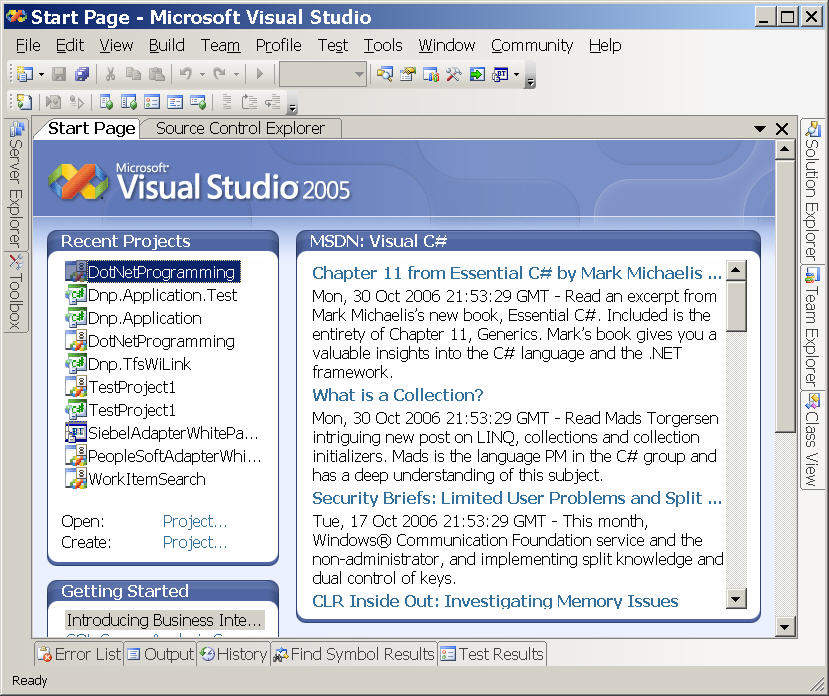

I just noticed today that Charlie Calvert has posted my Chapter 11 - Generics of my [Essential C# (Addison-Wesley)](/EssentialCSharp) book to the [C# Developer Center](https://msdn2.microsoft.com/en-us/vcsharp/default.aspx).  [Noah Coad](https://blogs.msdn.com/noahc) pointed out to me that this shows up in on the Start Page of Visual Studio if you have C# as you language (and SQL Server didn't change the RSS feed).

> 

Thanks Charlie!
