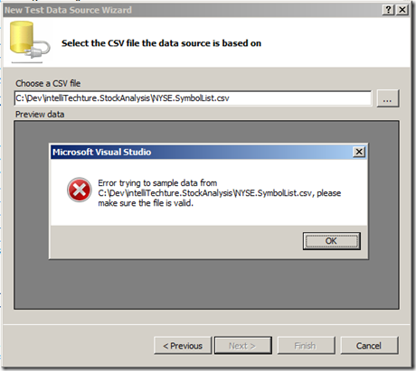

In Visual Studio 2008 you can specify a database, CSV, or XML file for the data connection string.  I decided to try using a CSV file because I had a sample CSV file of test data.  Unfortunately, on initial import I received an error message, “Error trying to sample data from <file name>, please make sure the file is valid.”  Hmmm…?  I tried several CSV file formats, changed the quote style, and the like - but still, I couldn’t get it to work.

It turns out, it was my file name.  I had two periods in the file name, NYSE.SymbolList.csv.  As soon as I removed the extra period, the file imported without issue.  By the way, quoting the file name also fails – the Next button remains disabled.

Also, column headers are expected in the import file.
