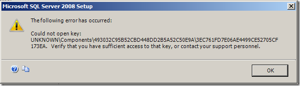
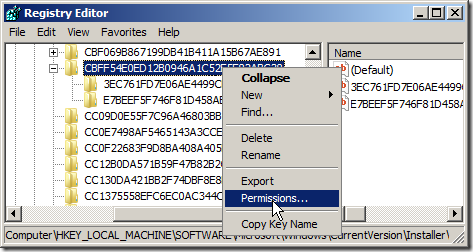

It all started with an installation of Visual Studio 2008 SP1, which included SQL Server Express 2005.  From there I wished to install SQL Server 2008 Standard on the default port and upgrade SQL Server 2005 Express to SQL Server 2008 express.  Unfortunately, this proved to be a troublesome desire.  I have no idea what the cause is exactly, except that I was not the only one on my team to have issues.

At this point, I am not sure the order that things occurred exactly, but I have a host of error messages and ways to handle them.  I can't say it will work for you - I sure hope you didn't have to go through all these to install SQL Server 2008 - but I did so I decided to share the experience.

**Uninstall procedure:**

The most important step with any failed SQL Server 2008 installation is uninstalling the failed attempt - yes, SQL Server 2008 needs to be uninstalled if an installation fails as it doesn't automatically roll back.

At the moment there is no complete knowledge base article on how to manually uninstall SQL Server 2008.  However, there are instructions for [how to uninstall an instance of SQL Server 2005 manually](https://support.microsoft.com/kb/909967) and there is a lot of similarity with SQL Server 2008, so review and follow those instructions were it makes sense.  Below is a list of the steps I followed:

1. Uninstall the the installation from **Programs and Features**/**Add Remove Programs**, selecting **Microsoft SQL Server 2008** and double clicking to run the uninstaller. (You always need to begin with this step or the command line equivalent.)  Do not use the Windows Installer Cleanup Tool to remove SQL Server 2008 without first trying to do so from **Programs and Features**/**Add Remove Programs**. During the uninstall, you can choose (via series of check boxes), which components of SQL Server 2008 to uninstall - including any shared components for when you have multiple instances.  In the case of multiple instances, each instance needs to be uninstalled independently.
2. Run SC.EXE query | find /i "SERVICE\_NAME: MSSQL" to verify that there are no services instances for SQL Server that should have been deleted but weren't.  Any items that appear unexpectedly, should be removed with the command SC.EXE delete <service name> Where service name is the name of the service returned by sc.exe query. If SC.EXE fails to uninstall the services and there are no other instances of SQL Server installed, delete registry keys HKEY\_LOCAL\_MACHINE\\SOFTWARE\\Microsoft\\MSSQLServer, HKEY\_LOCAL\_MACHINE\\SYSTEM\\CurrentControlSet\\Services\\MSSQLSERVER and HKEY\_LOCAL\_MACHINE\\SYSTEM\\CurrentControlSet\\Services\\SQLAgent
3. Search for <Instance Name> in HKEY\_LOCAL\_MACHINE\\SOFTWARE\\Microsoft\\Windows\\CurrentVersion\\Uninstall.  If you find any, usually on a value called InstanceId, run MSIEXEC /X <GUID> where the <GUID> is the key name containing the InstanceId value.
4. Delete the following registry keys/values if they exist
    - HKEY\_LOCAL\_MACHINE\\SOFTWARE\\Microsoft\\Microsoft SQL Server\\<Feature>.<Instance Name>
    - HKEY\_LOCAL\_MACHINE\\SOFTWARE\\Microsoft\\Microsoft SQL Server\\<Instance Name>
    - HKEY\_LOCAL\_MACHINE\\SOFTWARE\\Microsoft\\Microsoft SQL Server\\Instance Names\\SQL\\<Instance Name>
5. Delete %ProgramFiles%\\Microsoft SQL Server\\<Feature>.<Instance Name> if it exists.
6. Finally, search for the <Feature>.<Instance Name> in the registry and consider deleting any remaining items. In some cases this involves deleting the value because the other values within the same key are for a different instance.  In other cases, the entire key will need to be deleted because there is no other instance data within the key.  Hopefully, you won't encounter anything significant, but this is a good final step.

<Feature> has a value like MSSQL10 or MSAS10 <Instance Name> is the name of the SQL Server instance you are trying to uninstall.

Pheww, now that we have completely uninstalled, lets review potential errors you might encounter:

**Error**: A later version of Microsoft SQL Server Compact is already installed.

> Strange, since all I wanted was to install the SQL Server 2008 Tools.  Here are the steps to correct:

1. Uninstall all parts of the SQL Server Compact Framework 3.5 SP1.
2. Rerun SQL Server 2008 install.
3. After installing SQL Server 2008 Tools, downloaded and reinstalled the SQL Server Compact Framework SP1.  The tools are located here:

- [SQL Server Compact 3.5 SP1 for desktop](https://www.microsoft.com/downloads/details.aspx?FamilyID=dc614aee-7e1c-4881-9c32-3a6ce53384d9)
- SQL Server Compact 3.5 SP1 for Devices
- SQL Server Compact 3.5 SP1 Server Tools (Merge Replication Serve2r Side Config)
- SQL Server Compact 3.5 SP1 Books Online and Samples

**Error:** The following error has occurred: Could not open key: UNKNOWN\\Components\\CBFF54E0ED12B0946A1C52E5E82ABC38\\E7BEEF5F746F8AB9076051A5574.  Verify that you have sufficient access to that key, or contact your support personnel. (Errors could be for other GUIDs as well)

****

Errors could be for other GUIDs as well including UNKNOWN\\Components\\493032C95B52CBD448DD2B5A52C50E9A\\3EC761FD7E06AE4499CE52705CF173EA.

> This error is a permissions error in the registry.  If you search the registry for the first GUID you will find the key is likely mapped to HKEY\_LOCAL\_MACHINE\\SOFTWARE\\Microsoft\\Windows\\CurrentVersion\\Installer\\UserData\\<user SID>\\Components\\<GUID>.  Beneath this key is a sub key for the second GUID.  However, selecting the subkey will result in an access denied message.
> 
> To correct the problem:
> 
> 1\. Verify that you are running RegEdit as administrator (to avoid UAC issues with Windows Vista and Windows 3008+).
> 
> 2\. Edit the permission of the parent key(HKEY\_LOCAL\_MACHINE\\SOFTWARE\\Microsoft\\Windows\\CurrentVersion\\Installer\\UserData\\<user SID>\\Components) and click the **Advanced** button. (Optionally, you could edit the permissions on the parent GUID (CBFF54E0ED12B0946A1C52E5E82ABC38 in my example) but the same problem is likely to exist with other keys so you may as well deal with this in mass.)
> 
> 
> 
> 3.  From the Advanced dialog, select the **Owner** tab and check the **Replace owner on subcontainers and objects** check box.  Also, verify that System is the owner (else add System and be sure to select it so it will become the owner).
> 
> 4\. Next click **Apply**.
> 
> 4.  You may be presented with an error dialog, "Registry Editor could not set owner on the key currently selected, or some of its subkeys."  You can safely ignore this warning as long as you are then able to view the subkey.  If not :(, you may have to follow the same process but in safe mode or download [Process Explorer](https://technet.microsoft.com/en-us/sysinternals/bb896653.aspx) and search for any process that is holding onto the key so that you can shut it down.  (The idea that a process is preventing you from viewing the key is a stretch in my mind but I have had heard the Platform team of Microsoft's product support group suggest this.)
> 
> 5.  Lastly, select the "Effective Permissions" tab and verify that both your own User Id and the System user have **Full Control**.  If not, add both users via the **Permissions** tab.
> 
> If this still fails, consider resetting registry permissions back to the default settings using the following command:
> 
>     Registry security: secedit /configure /cfg %windir%\\inf\\defltbase.inf /db defltbase.sdb /verbose /areas REGKEYS

**Error:** SQL Server setup has encountered the following error. sku

> [Manually uninstall](/sql-server-2008-install-nightmare/#uninstall) SQL Server 2008 installation and try installing again.

**Error:** Error 1316.A network error occurred while attempting to read file ssceruntime-enu.msi.

> [Connect mentions this error](https://connect.microsoft.com/SQLServer/feedback/ViewFeedback.aspx?FeedbackID=363055).  I followed a similar procedure.
> 
> 1. Extract the ISO file or copy the SQL Server CD onto the local drive.
> 2. Copy the .\\<platform>\\Setup\\SSCERuntime.msi file to SSCERuntime-enu.msi within the same directory.  This seemed appears to work around the error.  I haven't tested this exhaustively, but I suspect this is a 64-bit problem only so the <platform> directory is most likely x64. (Please comment and let me know if you see this on other platforms.)

**Error**: Error result: -2068578301

> [Manually uninstall](/sql-server-2008-install-nightmare/#uninstall) SQL Server 2008 installation and try installing again

**Error**: SQL Server installation failed. To continue, investigate the reason for the failure, correct the problem, uninstall SQL Server, and then rerun SQL Server Setup.

> Sometimes, the error log points to a [message indicating there was a network error](https://www.microsoft.com/products/ee/transform.aspx?ProdName=Microsoft+SQL+Server&EvtSrc=setup.rll&EvtID=50000&ProdVer=10.0.1600.2).  During the occasions that I encountered this error message within the log, my installation failed with two red X icons in the concluding dialog, only one of which had a corresponding message (I wish I had taken a screen shot.)  The solution for me was to [manually uninstall](/sql-server-2008-install-nightmare/#uninstall).

**Error**: Could not find the Database Engine startup handle.

> This error appears after an installation completes unsuccessfully and a different error dialog appeared earlier in the installation.  [Manually uninstall](/sql-server-2008-install-nightmare/#uninstall) all the instance related installations items, address the previous dialog, and re-attempt the install.

**Error (during repair):** The SQL Server feature 'SQL\_Engine\_Core\_Inst' is not in a supported state for repair, as it was never successfully configured. Only features from successful installations can be repaired. To continue, remove the specified SQL Server feature.

> This error appears if you attempt a repair of a failed installation.  The work around it to [manually uninstall](/sql-server-2008-install-nightmare/#uninstall) the all items related to the instance, and re-attempt the install by addressing the original error.

**Error:** A MOF syntax error occurred.

> [Manually uninstall](/sql-server-2008-install-nightmare/#uninstall) and then re-attempt the install.

**Error**: SQL Express 2008 ERROR: Failed to generate a user instance of SQL Server and **Error:** Failed to generate a user instance of SQL Server due to a failure in starting the process for the user instance. The connection will be closed."

> Okay, admittedly this error doesn't appear during install, but it is an install related error none the less.
> 
> Recently I upgraded my SQL Express 2005 instance (installed by Visual Studio 2008) to SQL Server Express 2008.  (Visual Studio 2008 Express editions will automatically be upgraded when installing Service Pack 1, but not so with all other instances.)  After upgrading, none of my data driven unit tests were successfully passing.  Instead, they were failing with the message:
> 
> > The unit test adapter failed to connect to the data source or to read the data. For more information on troubleshooting this error, see "[Troubleshooting Data-Driven Unit Tests](https://go.microsoft.com/fwlink/?LinkId=62412)" in the MSDN Library. Error details: Failed to generate a user instance of SQL Server due to a failure in starting the process for the user instance. The connection will be closed."
> 
> It took some sleuthing to determine the solution.  Firstly, I checked the error files located in my %USERPROFILE%\\Local Settings\\Application Data\\Microsoft\\Microsoft SQL Server Data\\SQLEXPRESS (the connecting user's SQL Express data directory) directory.  That indicated errors were in loading the modal.mdf and corresponding log file within afore mentioned directory.  However, when connecting to the SQL Express instance from SQL Server Management Studio, there were no such issues.  This was because the instances connected to by SQL Server Management Studio were in the %PROGRAMFILES%\\Microsoft SQL Server directory.
> 
> Generally, when a new MDF file is connected to by SQL Express, it copies the master, model, MSDB, and tempdb databases (mdf and log files) into the connecting user's SQL Express data directory.  (This is frequently why the first time connecting for each user takes longer.)  Such a copy was unnecessary in my case because the databases already existed.  Unfortunately, the databases were from the SQL Server Express 2005 instance, and not the upgraded database from SQL Server 2008 Express.
> 
> To correct the problem, I
> 
> 1. Shut down SQL Server Express
> 2. Deleted the users SQL Express directory "%USERPROFILE%\\Local Settings\\Application Data\\Microsoft\\Microsoft SQL Server Data\\SQLEXPRESS"
> 3. Restarted SQL Server Express:
> 
> Here's a cmd script for what is needed:
> 
> > SC.EXE stop "MSSQL$SQLEXPRESS" CHOICE /C:N /D:N /N /T:5 RD /S /Q "%USERPROFILE%\\Local Settings\\Application Data\\Microsoft\\Microsoft SQL Server Data\\SQLEXPRESS" SC.EXE start "MSSQL$SQLEXPRESS"

**More Errors**:

> Unfortunately, this is not anything even close to an exhaustive list of errors.  If you have other messages I have not covered, the key place to check is %Programfiles%\\Microsoft sql server\\100\\Setup bootstrap\\Log\\<DateTime>. To begin, open the Summary\_<computername>\_<DateTime>.txt file to see an overview of the results.  If that doesn't help, consider reviewing one of the Detail\*.txt files.  These errors are all addressed in [KB909967 - How to troubleshoot SQL Server 2008 Setup issues](https://support.microsoft.com/kb/909967).
> 
> Another item that seemed to cause instability in my SQL Server 2008 installation was mounting the SQL Server 2008 iso file (especially mounting it over the network).  I recommend that you extract the ISO into a local directory and then installing from the local directory.
> 
> Overwhelmingly, the correction is to [manually uninstall](/sql-server-2008-install-nightmare/#uninstall) the attempted install instance.
