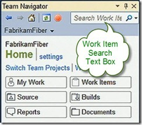
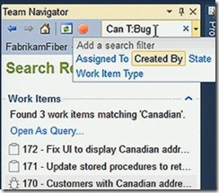

Finally, there will be a search everything in Visual Studio vNext.  Here are a couple screen shots:

> 

Notice from the second image that there is a “standard” search syntax allowing you to search specific fields within the work item.
