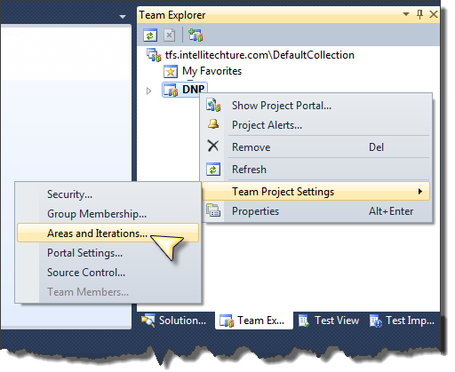
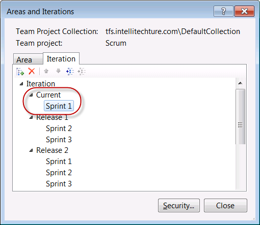
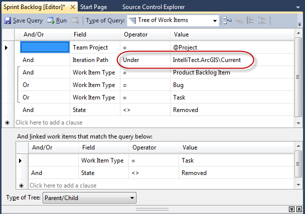

### Post updated for  VisualStudio.com and Visual Studio 2013 Update 5:

VisualStudio.com, or VSO, recently added support for the query token @CurrentIteration.  @CurrentIteration can be used in your queries to refer to the sprint or iteration that is currently in process.  This eliminates the need to create your own Current iteration as described in our original post below.  This update is also included in Visual Studio 2013 Update 5 for on premise TFS deployments.

You can read more about this feature here: [https://www.visualstudio.com/en-us/news/2015-mar-10-vso.aspx](https://www.visualstudio.com/en-us/news/2015-mar-10-vso.aspx)

### Transitioning between Sprints/Iterations when using prior versions of Team Foundation Server (TFS)

Our previous approach to this still works if you are using any prior version of Team Foundation Server on premise:

When transitioning from one Sprint (or iteration) to another it is necessary to modify all “current sprint” queries and any additional custom queries that are sprint/iteration specific. This is not a one time activity per team project but rather something you have to do after every sprint.

One way to eliminate this step is by creating a “release” called “Current” and moving the specific current sprint (Sprint 1, Sprint 2, or 2012-02-06 for example) under this release. The current sprint is simply moved from its defined release into the Current release when the sprint starts. When the sprint ends, the sprint is moved back to its original release and a different sprint moved under the Current release. Then, by changing all the sprint specific queries to select item under Current release, it is no longer necessary to change the queries every release – they just work.

Here are the steps in more detail:

1. To create a new release for Current, use the Areas and Iterations dialog and add a new Child Node. Once created, we position Current as first in the list. The dialog below shows Current and Sprint 1 as a member, indicating that Sprint 1 is the current sprint. 
2. Next, all the queries defined under Current Sprint are modified to use the “under Current” clause. This modification only needs to be made one time when the project template is being configured. Below is a screen shot after modifying the Sprint Backlog query. 
3. When moving from one sprint to the next, simply change the sprint hierarchy so that the new sprint (Sprint 2 for example) appears below the “Current” release and the previous sprint (Sprint 1) is returned to the correct release structure.

With these changes in place, the queries will just work as is when you transition from one sprint to the next.  Furthermore, this technique is valid and expected to work for TFS Preview, TFS11, Microsoft Visual Studio Scrum 1.0, and MSF for Agile.

(Note: Releases are not required, you can just have a parent node (Current) that appears anywhere in the hierarchy and move the Current Sprint below that – with corresponding queries to match.)
