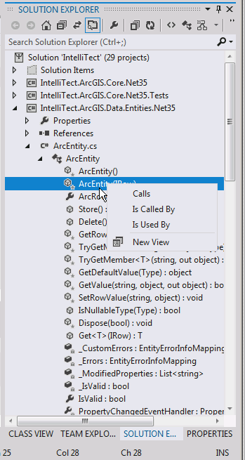
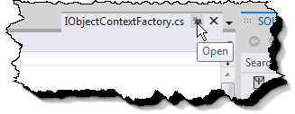

In Visual Studio 11, there is a set of IDE productivity improvements that developers across all platforms and languages already be familiar with because earlier versions of them were available in an update for Visual Studio 2010 under the name [Productivity Power Tools](https://bit.ly/zBRXHI).  In post we review several of these enhancements.

In Visual Studio 11 **Solution Explorer** has been revamped significantly.  No longer is it just a location to navigate files, it now supports navigation over the object model of constructs within the solution, full-text identifier search, and more.  For example, you can now expand a CSS file to see nodes corresponding to the classes within the file and then expand the class further to view its members (see Figure 1) – similar to what is available in the Visual Studio 2010 object explorer.

\[caption id="attachment\_2760" align="aligncenter" width="349" caption="Figure 1: Visual Studio 11 Solution Explorer"\]\[/caption\]

Right-clicking on class member displays a context menu for browsing the call hierarchy of the member (see context menu in Figure 1).  Similarly, right-clicking on a class displays a Contains, Base Types, Derived Types, and Is Used By context menu for additional call structure exploration.  In both cases, the New View button () appears, allowing a new view focused on the selected item to open. In addition to the call hierarchy context menu, and as one would expect, double-clicking on the node will launch you to the definition of that construct or open up the file corresponding to it. With this enhanced solution explorer comes an additional Windows Preview option as well.  Single-clicking on a node in Solution Explorer opens up a document in preview mode. This option reserves a reusable document tab in the IDE such that each time a file is opened, it appears in the same document tab as the previously opened documents.  The result is that you can preview files without opening a myriad of unneeded document tabs.  The document tab can then be Promoted through a button glyph (see Figure 2) on the tab itself or automatically when the file is edited.

Figure 2: Visual Studio 11 Tab Promot Button

Where the preview tab really cleans up the IDE is during debugging or Go To Definition (F12), where a myriad of windows will otherwise proliferate.  Instead, the same tab window is recycled for all the documents you preview while debugging or browsing through the code. A similar feature to the preview tab is “tab pinning.”  In place of the “Promote” button found on the Preview Tab (Figure 2), normal tabs have a pin icon ( ) that moves the tab to the left of the tab well.  Any new documents that are opened will appear to the right of the last pinned tab – effectively holding the position of the pinned tabs unless they are moved deliberately There are several additional Solution Explorer related features to be aware of.  Firstly, it is no longer necessary to open up a graphics file (.JPG, .PNG, etc.) in order glimpse it.  Instead, Visual Studio 11 supports hovering over the file within Solution Explorer, triggering a dynamic preview image of the graphic.  Secondly, when renaming files in the solution explorer, it now behaves like Windows Explorer.  The default selected text after issuing a rename action is the file name but not the extension.
