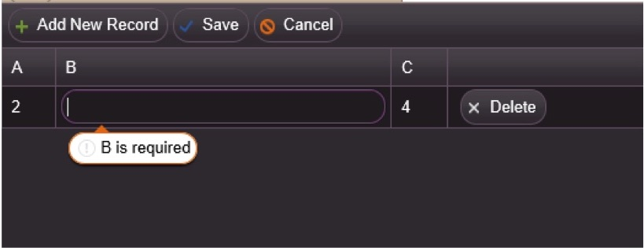
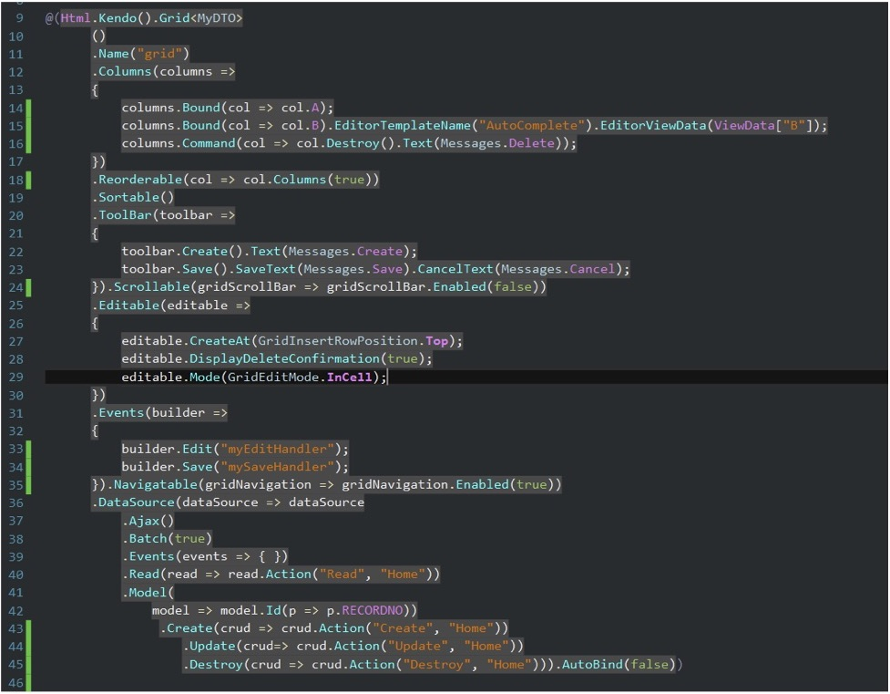

Estimated reading time: 3 minutes

I was recently on a project that required various dynamic client-side behavior of a Kendo grid. There was specific behavior needed when the user entered a cell and when the value of a cell changed.

An equivalent example for demonstration purposes is the following grid.

Assume the grid has the following rules:

- Specifying behavior upon entering a cell: Column A is the “master” column that specifies whether or not column B is mandatory, optional, or required based on A’s value (1 = blocked, 2 = mandatory, other values = optional)
- Specifying behavior upon leaving a cell: Column C is simply column A’s value times two.

The above screenshot shows what happens if a user tabs out of column B when A’s value is 2.

I found many solutions to the first requirement centering around making a check, and then closing the grid’s cell via the closeCell() method on the grid. However, I found this interfered with the tabbing behavior.

As for the second requirement, the trick is to leverage the grid’s Save event handler with the appropriate javascript. The C# and Typescript are below.

### Typescript

The typescript used below is nearly identical to the Javascript syntax:

/// <reference path="../typings/jquery/jquery.d.ts" />
/// <reference path="../typings/kendo/kendo.all.d.ts" />

var MANDATORY = "Mandatory";
var BLOCKED = "Blocked";
var OPTIONAL = "Optional";
var KENDOAUTOCOMPLETE = "kendoAutoComplete";
var KENDODROPDOWNLIST = "kendoDropDownList";
var KENDODATEPICKER = "kendoDatePicker";

$(document).ready(() => {
});

//Invoked once a cell is entered
function myEditHandler(e) {

    if (e.model.get("A") === 1) {
        setEditorProps(e, "B", BLOCKED);
    } else if (e.model.get("A") === 2) {
        setEditorProps(e, "B", MANDATORY);
    } else
        setEditorProps(e, "B", OPTIONAL);
}

function getGrid(): kendo.ui.Grid {
    return $("#grid").data("kendoGrid");
}

function getEditor(e, columnId) {
    return e.container.find("\[id=" + columnId + "\]");
}

//Returns one of the various kendo widgets for a cell
//In this example, we're only using the auto complete widget
function findWidgetForEditor(editor) {

    var data = editor.data();
    if (data) {
        return data.handler;
    }
    var widget = editor.data(KENDOAUTOCOMPLETE);
    if (widget) {
        return widget;
    }
    widget = editor.data(KENDODATEPICKER);
    if (widget) {
        return widget;
    }
    widget = editor.data(KENDODROPDOWNLIST);
    if (widget) {
        return widget;
    }

    return null;
}
function setEditorProps(e, id, validity) {

    var widget: kendo.ui.AutoComplete;
    var editor = getEditor(e, id);
  
  if (editor.length == 1) {
        widget = findWidgetForEditor(editor);

        if (!widget) {
            return null;
        }

        if (validity == BLOCKED) {
            //you can do cose cellbut it will mess up the tabbing             
            //getGrid().closeCell();
            //the below method blocks and preserves the tabbing
            widget.dataSource.data(); //set data to nothing
            widget.readonly(true); //make auto complete editor read only
            e.container.focus();
            editor.prop('required', false);
        } else if (validity == MANDATORY) {
            editor.prop('required', true);
            widget.readonly(false);
        } else if (validity == OPTIONAL) {
            editor.prop('required', false);
            widget.readonly(false);
        }
    }
    return widget;
}

//invoked when a column is saved
function mySaveHandler(e) {

    var a = e.values.A;
    if (e.values.A) { //this occurs when we've just left column A
        e.model.set("C", a \* 2);
    }
}

### Want More?

Check out some of my other blogs _[Using the Kendo Grid in an Unorthodox Manner](/using-the-kendo-grid-in-an-unorthodox-manner/)_ and _[Demystifying the Requirements-Gathering Environment](/demystifying-requirements-gathering/)_.

