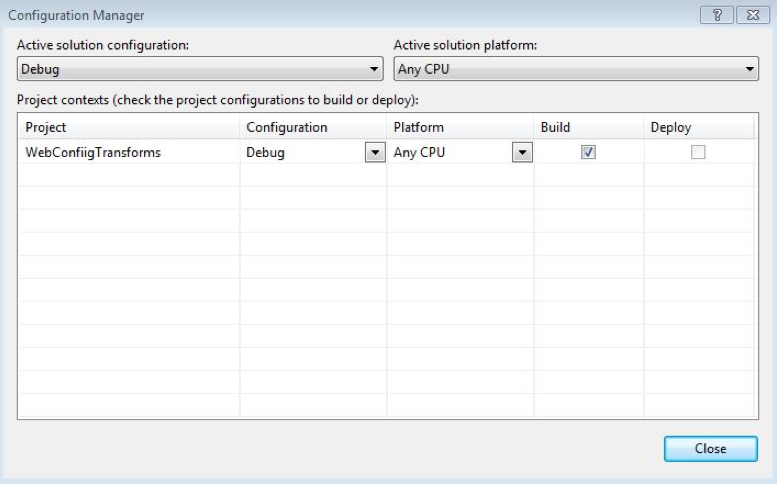
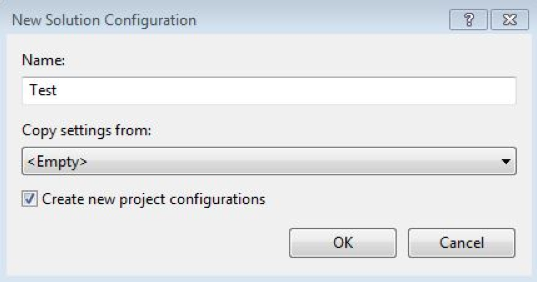
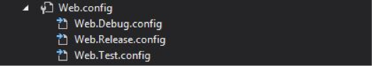
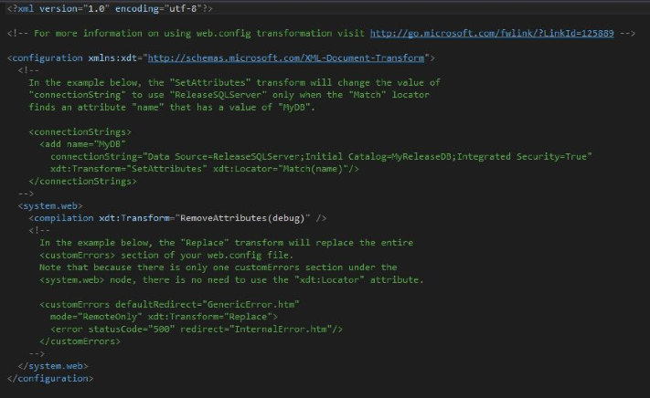
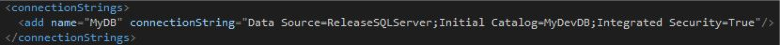
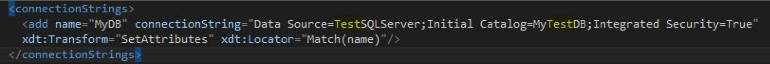
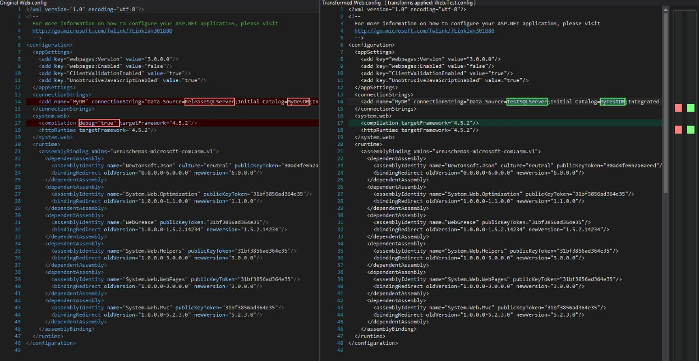
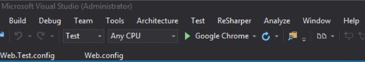

In today’s software development process, it is recommended to have three different environments, shown below, when you are working with business critical systems. Web.config transforms help developers publish to these environments.

1. a development environment - this is where the developers live
2. a test environment - an exact match to production
3. a production environment - serves the business end customers

When deploying a web site to different environments, such as these, you will want your test and production web.config to be different than the development web.config. Some examples of web.config settings that should be different include connection strings and debug settings.

It surprises me how often I see a single web.config in source control, whether it being dev, test, or production, or even worse, a mixture of all three. Then, when it is deployed to the destination environment, a developer opens up old trusty notepad and modifies the web.config directly.

This is not only inefficient, it is very dangerous! If there is a typo or a change was missed there could be some very strange behavior or even errors shown to the customer. This is where web.config transforms come in so we can have a config transform setup and check into source control for each environment we want to publish to. I will now get into how to set that up in Visual Studio.

The first step is to create the build configuration for our environment; let’s say this is the build for test. To do this, we will need to access the Configuration Manager in Visual Studio from the Build Menu.

Next, let's select New under the Active Solution Configuration dropdown, then the New Solution Configuration dialog appears. Here we can name our Solution Configuration “Test” and copy settings from one of the default settings or leave it empty. For now, we will leave it as empty and leave “Create new project configurations” checked.

After clicking “OK” we now have a new solution configuration and we can now create a new web.config transform. In the solution explorer, right click the base Web.config and select Add Config Transform. This will have generated config transforms for all of our Solution Configurations. By default there is Debug and Release and we have added Test.

To access the new transform, open Solution Explorer and expand Web.config. There should be three transforms available.

Open up Web.Test.config and you will notice in Visual Studio 2015 that the newly generated config transform has some helpful comments about how to set up this web.config transform.

So let’s start with their example with connectionStrings and add a dev connection string to our base Web.config file

In our config transform for our Test environment we will want the connection string pointing to the Test database not the Dev database. So to accomplish this we can use either example given in the comment in Visual Studio. I have chosen to use the first example and use the SetAttributes transform. Below you can see where I changed the DataSource and Catalog to the test database and added the SetAtrributes transform to match on name.

 Now that we have the transform in place for the connection string, we can preview what our web.config would look like if this transform was applied. To do this, right click on Web.Test.Config and select Preview Transform. The results are shown below..

Now there is one more important feature to understand when using these transforms. In case you want to run different configs locally, you can select which configuration solution is active by selecting it in the drop down in the Visual Studio toolbar.

