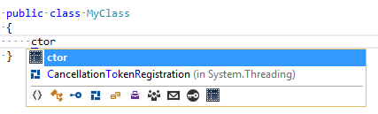
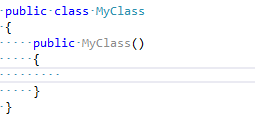
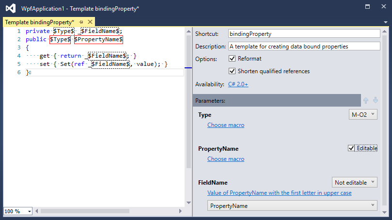
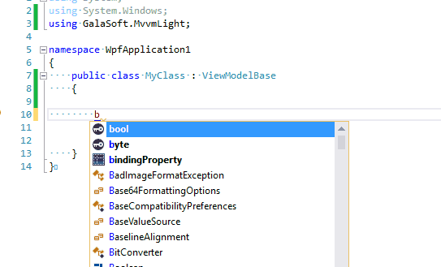

We all like to be efficient. Writing boilerplate code (that stuff you have to write to make everything work) is one such task that I am always looking to reduce or eliminate. One of the easiest ways I have found is by using a feature in [ReSharper](https://www.jetbrains.com/resharper/) called [Code Templates](https://www.jetbrains.com/resharper/features/code_templates.html). There are several different types of templates, but I would like to highlight the live templates. For these examples I will be using ReShaper 10, but this feature has been around for several versions.

Live templates appear in the regular intellisense menu. When selected they insert snippets of code.

For example simply typing in “ctor”

And pressing Enter, will produce:

This is just one example of a live code template. There are many that come pre-installed with ReSharper. What makes this an amazing feature is that we can create our own templates to meet our needs. Let’s take a look at a practical example.

I do a lot of MVVM work and favor using the [MVVM Light](https://www.mvvmlight.net/) framework. For those unfamiliar with MVVM Light, the code to create a bindable property looks like this:

private string \_MyProperty;
public string MyProperty
{
   get { return \_MyProperty; }
   set { Set( ref \_MyProperty, value); }
}

You will quickly notice that there is a lot of redundant information in this property. We can create a live template to generate properties in this form for us.

Open the Template Explorer, from the ReSharper>>Tools menu, and click the New Template option.

The first thing to do is set a shortcut and a description. The shortcut is the text that you will type into your code to invoke the template. It is also worth pointing out that you are not limited to C# templates. **You can create templates that are available in a variety of languages and coding contexts.** Click on the Availability link to see all of the possibilities for your template.

To add the contents of the template we will enter the code from above, replacing the duplicated parts with template parameters. Parameters are declared by surrounding the name with dollar signs. As you enter parameters they will start to show up on the right in the parameter’s list. In this area you can change the order that parameters will be filled in when the template is invoked, if the parameter should be editable, and if the parameter’s default value should be populated from a macro.

In this example, we want to edit the $Type$ parameter first, but to keep things together I have modified the parameter to edit the second occurrence of the parameter (note the M-O2). Then the template will prompt to fill in the $PropertyName$ parameter. The $FieldName$ parameter will not be editable. Editable parameters will prompt for a value. In this case, rather than prompting for a value we simply select a macro to populate its value with the value in $PropertyName$.

Below you can see the template in action:

Live code templates can significantly reduce the amount of boilerplate code that you have to write. Since they are so easy to create and use, [try creating your own](https://www.jetbrains.com/resharper/help/Templates__Index.html).
