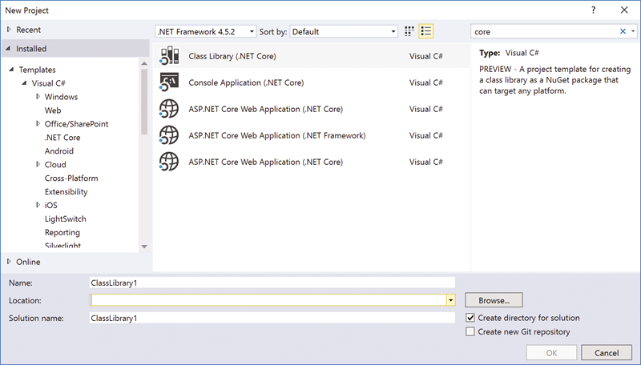
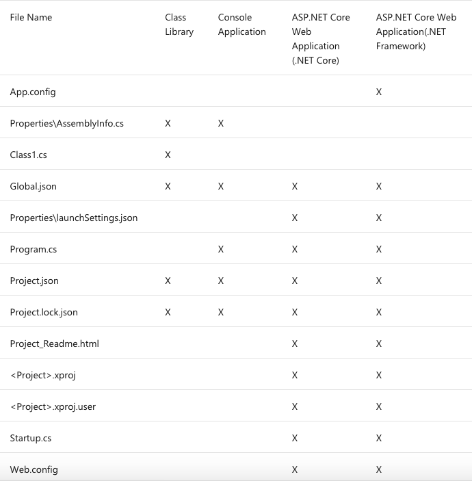
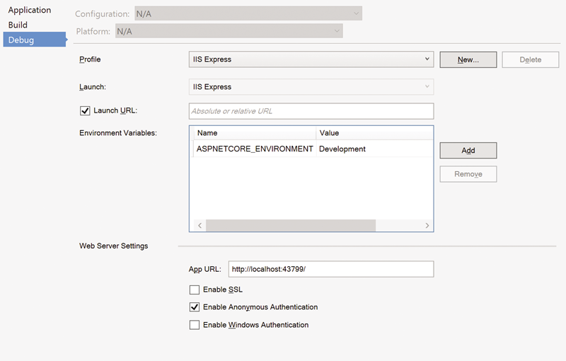
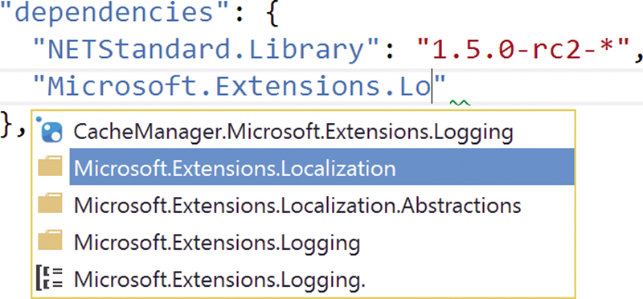

.NET Core RC2 is finally here, and this time it is, in fact, a true “Release Candidate” rather than an RC1 Beta masquerading as a release candidate (if that, considering all the changes that happened after it came out). Much of the development focus and press surrounding .NET Core is, of course, about its cross-platform capabilities. This focus on supporting Linux and Mac OS X has led not only to a new .NET API, but also to an accompanying runtime and even a toolset. Tools such as DOTNET.EXE (formerly DNX, DNVM and DNU), not to mention Visual Studio Code, are all about giving non-Microsoft developers an opportunity to leverage .NET, and even more, a first-class developer experience.

This is all very well—and, in fact, amazing—but what about longtime Microsoft developers? How do they continue development on Windows and Visual Studio with .NET Core projects? In this article I’m going to talk about the various .NET Core project types and explain the details of the new file types and their functions. I’ll also delve into how the new project structure supports side-by-side debugging of any open source NuGet packages you might reference, and how you can step into the source code for such projects.

### Getting Started

Before you can begin leveraging .NET Core RC2, you’ll obviously want to update your tools—in this case Visual Studio 2015—to support the new platform. This essentially involves two steps:

1. Downloading the .NET Core Tooling Preview 1 for Visual Studio 2015 from [microsoft.com/net/core#windows](https://microsoft.com/net/core#windows) (where you’ll also find instructions).
2. Installing the NuGet Package Manager from [bit.ly/27Rmeaj](https://bit.ly/27Rmeaj).

I’m assuming you have Visual Studio 2015 installed already, but if not, Visual Studio Community Edition is available for free at [visualstudio.com](https://visualstudio.com).

### New Project Types

Once all the Visual Studio tooling is installed you can use the New Project wizard to create your project (**see Figure 1**).

Figure 1 Visual Studio .NET Core Project Templates

As you can see, there are four project types (one appears twice as it resides in both the Visual C#\\Web and Visual C#.NET Core folders). Obviously, each project type generates a different set of files, as shown in **Figure 2**.

Figure 2 The Files Included in Each Visual Studio Project Type

App.config is an optional configuration file similar to the traditional <appname>.config, used since the .NET Framework 1.0. The following code shows the default file, which identifies whether to use server-based garbage collection or client/workstation-type garbage collection (see [bit.ly/22nm32o](https://bit.ly/22nm32o) for more information):

<configuration>
  <runtime>
    <gcServer enabled="true"/>
   </runtime>
</configuration>

AssemblyInfo.cs identifies assembly data, such as configuration, company, product and trademark. This is the standard AssemblyInfo.cs file that has been part of Visual Studio .NET projects since .NET was first released in 2000.

Class1.cs is a skeleton C# class file for the Class1 class and includes its default constructor.

Global.json is generated automatically as long as you select “Create a directory for your solution” when creating your first .NET Core project. As detailed later in the article, the project’s node identifies additional locations for source code when debugging.

LaunchSettings.json identifies the various Web hosting configuration settings, including an application URL for debugging; an IIS host (such as IIS Express) if any; environment variables to set before launching, used, for example, by .NET Core Configuration to identify the environment (development, test or production); and SSL and authentication. Changes made from the Debug tab on Project Properties Window of Visual Studio provide a UI for editing the launchSettings.json file, as shown in **Figure 3**.

Figure 3 Debug Tab on the Project Properties Window of Visual Studio

**Figure 4** shows a sample launchSettings.json file.

**Figure 4 Sample launchSettings.json File**

{
  "iisSettings": {
    "windowsAuthentication": false,
    "anonymousAuthentication": true,
    "iisExpress": {
      "applicationUrl": "http://localhost:43799/",
      "sslPort": 0
    }
  },
  "profiles": {
    "IIS Express": {
      "commandName": "IISExpress",
      "launchBrowser": true,
      "environmentVariables": {
        "ASPNETCORE\_ENVIRONMENT": "Development"
      }
    },
    "WebApplication1NetFramework": {
      "commandName": "Project",
      "launchBrowser": true,
      "launchUrl": "http://localhost:5000",
      "environmentVariables": {
        "ASPNETCORE\_ENVIRONMENT": "Development"
      }
    }
  }
}

Project.json is a new project file whose functionality overlaps, in large part, with that of the \*_.\*_PROJ file. It identifies such things as project references, build options like the version number, and identifies the platform to compile to—whether .NET Core or .NET Framework, for example. More on this shortly.

Project.lock.json stores a list of the files (usually NuGet references) needed for compilation. It includes specific package version numbers, unlike the project.json file, which supports wildcards. Without project.lock.json, an entire restore of packages will occur. Project.lock.json includes a package graph along with other data related to packages that have been downloaded locally (restored). Generally, this file isn’t checked in and, when it doesn’t exist, it’s recreated by running a NuGet package restore. This file is listed as a child of project.json within Visual Studio.

ClassLibrary.xproj is the MSBuild file that, out of the box, defines what will happen when you build the project. The latest version imports Microsoft.DotNet.targets, which defines build tasks that leverage the new DotNet.exe command. Unlike MSBuild proj files in the past, xproj files are surprisingly small because much of the information has moved (for the moment) into project.json.

ClassLibrary.xproj.useroverrides the Class­Library.xproj file and provides additional MSBuild properties such as local user debug-specific settings like ports. Generally, this file isn’t checked in because it’s user-­specific, and it’s not visible from within Visual Studio.

Program.cs defines a Program class that includes the definition of the Main entry point for your application—even for Web applications.

Web.config provides a minimal configuration for IIS, instructing it where to find the Web host process and configuring that all traffic is redirected to this process, as shown in the following code:

<?xml version="1.0" encoding="utf-8"?>
<configuration>
  <system.webServer>
    <handlers>
      <add name="aspNetCore" path="\*" verb="\*" modules="AspNetCoreModule"
        resourceType="Unspecified"/>
    </handlers>
    <aspNetCore processPath="%LAUNCHER\_PATH%" arguments="%LAUNCHER\_ARGS%"    
      stdoutLogEnabled="false" stdoutLogFile=".\\logs\\stdout"
      forwardWindowsAuthToken="false"/>
  </system.webServer>
</configuration>

Notice that web.config no longer contains app settings, which are instead moved into configuration files that are loaded by Microsoft.Extensions.Configuration as I outlined in my February 2016 article, “Configuration in .NET Core” ([bit.ly/1OoqmkJ](https://bit.ly/1OoqmkJ)).

Note that with all .NET Core project types created by Visual Studio, selecting the “Create a directory for your solution option” when creating a new project places all the source code into an src subdirectory for the solution. Furthermore, it’s expected that test projects will be placed into a test directory alongside src (although this will not happen by default in the .NET Core Tooling Preview 1 for Visual Studio 2015 release). Other possible directories to consider would be for things like builds and docs. (I confess I’d much prefer to keep my test projects alongside the target project they’re testing, rather than in an entirely separate tree, but this isn’t what Microsoft selected for the default solution structure, and experience tells me to embrace the default where possible rather than attempt to fight it.)

### More on Project.json

Perhaps the most significant file in the new .NET Core project structure is project.json. This file is designed to:

- Replace the NuGet File Manager package.config file, which identifies the NuGet references for the project.
- Specify which frameworks the project supports, and configuration details for how to build the project for the specific framework.
- Identify the target platform for self-contained apps, which contain all their dependencies including the platform-specific .NET Core runtimes needed for the corresponding platform. Or, if the project is a portable app, project.json identifies which frameworks the project expects to be installed on the target machine on which the assembly will execute.

These three tasks are spread across four main sections within project.json (I combine runtimes and supports as the functionality overlaps, depending on the project type):

Dependencies: This section lists each of the NuGet packages on which your project depends, including the version number of said dependencies. Version numbers can be specified with wild cards so you can allow “the most recent version” that matches the wild card to be downloaded automatically by the NuGet Package Manager restore. A pair of empty quotes for the version number says, “Use the latest available.” Furthermore, while you can add references via the Visual Studio NuGet Package Manager window, you can also rely on the way Visual Studio asynchronously loads IntelliSense with the packages available from your configured package source or feed (see **Figure 5**). The IntelliSense works for both the package name and the version number.

Figure 5 IntelliSense Dynamically Loads with the List of Available Packages and Versions

Frameworks: In this section you identify the frameworks on which your project will run: net45, netstandard1.5, net40, for example. In addition, you can provide buildOptions, dependencies, frameworkAssemblies, and imports—app-specific to the identified framework. For example, to allow unsafe code for the .NET 45 execution environment, you can specify within the frameworks element:

"net45": {"buildOptions": {"allowUnsafe": true}}

Runtimes/supports: Whether project.json uses runtimes or supports depends on whether the project is targeted as a portable or a self-contained app. For self-contained apps, the runtimes section identifies which OSes will be supported and, therefore, which runtime libraries to bundle into the application. A self-contained application has no dependencies (at least as far as .NET is concerned) on anything preinstalled on the target machine.

In contrast, the supports section identifies for portable apps the runtime dependencies an app will look for when it starts up—any one of which will be sufficient. The list isn’t restrictive (you may be able to run elsewhere), but a supports element will cause NuGet to check that all dependencies are satisfied.

While project.json is critical within RC1 and RC2, ironically, not long after RC2 was released, the .NET Core and ASP.NET teams determined that project.json was, in fact, redundant to the already well-established MSBuild project file, which already supports significantly more functionality, including configuration, build dependencies, build targets, compilation flags, command-line and environment-variable property settings, and build commands. Rather than reinvent all this, the team reviewed what triggered the project.json file creation in the first place and realized that \*_.\*_PROJ files were generally very bloated—listing every file within a project individually, for example, rather than using globbing patterns (wild cards). The bloat is so significant, in fact, that developers rarely open and review the file before running a build, even though poten­tially the file could have some undesirable commands embedded in it. Rather than creating an entirely new build file, the team instead decided to fix the bloat within \*_.\*_PROJ files and even provide a command-line utility for editing it. The only thing project.json has that \*_.\*_PROJ files don’t is the JSON syntax. (But, after all, JSON is just the modern-day XML, just like XML was \[in its day\] the modern-day flat file or INI file.) For more information on project.json’s potential demise, see Damian Edwards’ announcement during the ASP.NET May 10, 2016, Community Standup and the corresponding post by Alexandre Mutel ([bit.ly/1NJ9r31](https://bit.ly/1NJ9r31)).

### Debugging Package Source Code

One of the features I’m most excited about is the new support for debugging and stepping into packages, and even modifying the source code of the packages if it’s available. Suppose, for example, you have a company-wide “Framework” assembly that’s shared among numerous teams. However, the Framework package is essentially open source, such that anyone within the company (or, even better, outside the company) can contribute improvements and changes. Now, imagine if you reference the NuGet package for this Framework but at some point suspect there might be a bug that needs fixing or perhaps an enhancement is warranted. Normally, this requires working with the source code from the component independently of your project/solution. What if, instead, you were able to download the source code and update it as an integrated experience alongside your main development—even stepping into the code without relying on a symbol server or PDB files being available? Fortunately, this is a key scenario enabled in Visual Studio 2015.

For example, imagine you want to debug the Microsoft.Extensions.Logging package, which is available on GitHub. To add and debug it within your project, you want to download (perhaps using the git clone or git submodule command) the source code. Next, in order for Visual Studio to know where to find the source code, you need to edit the global.json project node, for example, adding “submodules\\Logging” to the list of directories it watches:

{
  "projects": \[ "src", "test", "submodules\\Logging" \],
  "sdk": {
    "version": "1.0.0-\*"
  }
}

You can, of course, provide the full path (if, for example, you didn’t clone the code into a subdirectory). However, note that the directory separator is either two back slashes (\\) or a single forward slash (for example, c:/users/mark/documents/visual studio2015/Projects/Microsoft.Extensions.Logging).

Once Visual Studio successfully finds the source code after global.json is updated and saved, it will automatically add the project to your solution such that you can then debug into the source code.

A fairly naïve algorithm is used to determine which source code directory to load:

1. If any of the source code locations specified in global.json contains a folder with the same name as the package (such as Microsoft.Extensions.Logging) and that folder contains a file named project.json, the debugger will use that folder and the source files inside it.
2. Otherwise, the compiled binary from the packages folder is loaded.

See “Debugging ASP.NET 5 Framework Code Using Visual Studio 2015” ([bit.ly/22niJ7w](https://bit.ly/22niJ7w)) for more information.

### Wrapping Up

If you haven’t yet started to dive into .NET Core, now is a great time to do so, giving you the longest time span in which to amortize the learning curve. For those of you contemplating upgrading from earlier versions, the same is true. Chances are good you’ll be upgrading at some point, and the sooner you do, the sooner you can take advantage of its new features.

_Thanks to the following IntelliTect technical experts for reviewing this article: Kevin Bost._

_This article was originally posted [here](https://docs.microsoft.com/en-us/archive/msdn-magazine/2016/july/essential-net-visual-studio-2015-with-net-core-tooling) in the July 2016 issue of MSDN Magazine._
