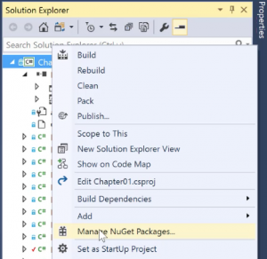
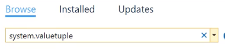
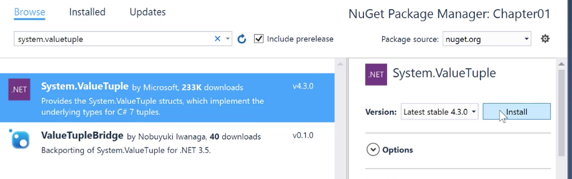
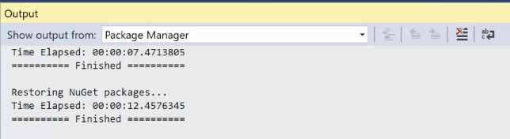
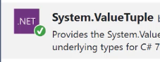
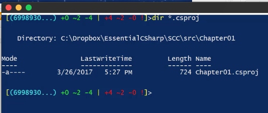
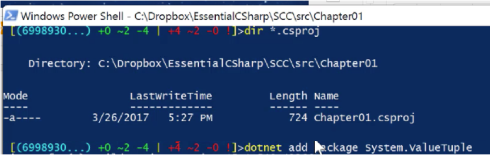
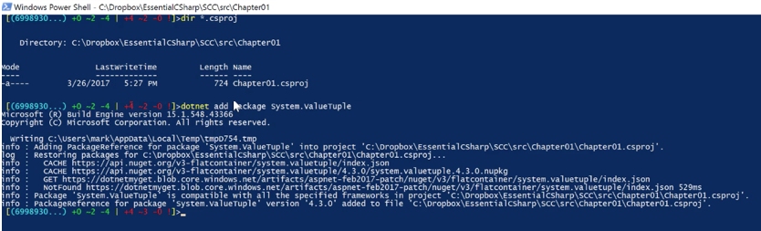

Estimated reading time: 4 minutes

As soon as you start programming tuples in C# 7.0, you are likely to encounter the compiler error, "Predefined type 'System.ValueTuple' is not defined or imported."

This issue easily corrects. When encountered, the error will look like this on the code editor:

The issue is that the C# 7.0 compiler is trying to generate the underlying CIL code that supports the tuples with the `System.ValueTuple<...>` type that corresponds to the arity of your C# 7.0 tuple code.

To fix the issue, you need to reference the System.ValueTuple NuGet package either via Visual Studio's NuGet manager or via the Package Manager Console.

Note that this issue will no longer occur for projects using .NET 4.7 or later.

If you cannot update the .NET version of the framework that your project is targeting, you will need to use the provided steps to correct your error.

We will discuss two quick options to correct your error so you can get back to coding.

### Option 1

#### Step 1

Right-click on your project in the Solution Explorer and click on _Manage NuGet Packages_.

### 

#### Step 2

Click _Browse_ then type '`System.ValueTuple`' in the search bar.

#### Step 3

Select the option for `System.ValueTuple` in the search results and then click _Install_.

#### Step 4

A dialogue will start. This asks you to accept the license terms. Click _Accept_. The program will go to the internet and download the NuGet package for you.

A green arrow will appear by the `System.Value.Tuple` icon confirming that the NuGet Package has been restored.

That is all that is required. When you return to your code editor, the error is gone.

### Option 2

#### Step 1

Go to the command line wherever your project file is.

#### Step 2

Type 'dotnet add package `System.ValueTuple`' and hit enter.

Now the package is added. The project will refresh.

Viola! Return to your project and continue coding.

Please comment with any other questions or concerns about the issue: "Predefined type '`System.ValueTuple`' is not defined or imported."

### Want More?

Check out my other [blog on C# 7](/csharp7-tuples-explained/) and leave any questions below!

