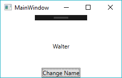
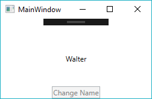

## Master the Basics of MVVM to Simplify Building WPF Applications

Estimated reading time: 9 minutes

The Windows Presentation Framework (WPF) takes full advantage of the Model-View-ViewModel (MVVM) pattern. Though it is possible to create WPF applications without using the MVVM pattern, a little investment in learning can make building WPF applications much simpler.

If you are just getting started with WPF, I suggest looking at this [getting started](https://docs.microsoft.com/en-us/dotnet/framework/wpf/getting-started/index) [guide](https://docs.microsoft.com/en-us/dotnet/framework/wpf/getting-started/index).

### Contents

- [Master the Basics of MVVM to Simplify Building WPF Applications](#h-master-the-basics-of-mvvm-to-simplify-building-wpf-applications)
    - [The Three Pieces of MVVM](#h-the-three-pieces-of-mvvm)
    - [Bindings - Keeping it in context](#h-bindings-keeping-it-in-context)
        - [Binding Example](#h-binding-example)
        - [Related concepts for further reading](#h-related-concepts-for-further-reading)
    - [Commands](#h-commands)
        - [Commands Example](#h-commands-example)
        - [Related concepts for further reading](#h-related-concepts-for-further-reading-1)
    - [Want More WPF Tips and Tricks?](#h-want-more-wpf-tips-and-tricks)

### The Three Pieces of MVVM

Let's look at the the three pieces of MVVM: Model, View, and View Model.

**View:** These are all of the UI elements, the pretty face of your application. For WPF, these are all of your XAML files. They may be Windows, User Controls, or Resource Dictionaries. Though it is certainly possible to construct the view entirely from code, the vast majority of the UI will (and should be) built with XAML. The view may be quite dynamic, and even handle some user interaction (see the Commands section below).

**View Model:** These are the objects that provides the data and functionality for each of your views. In general there is typically a one-to-one mapping between views and view model classes. The view model class, exposes the data to the view, and provides commands to handle user interaction. Unlike other design patterns, **the view model should not know about its view**. This separation of concerns, is one the key tenets of MVVM. The view model is the connection between the view and model.

**Model:** Broadly speaking the model provides access to the data and services that your application needs. Depending on your application, this is where the real work gets done. While the view model is concerned with pulling together the model’s data, the model classes perform the actual work of the application. If you are using dependency injection, the model classes will typically be passed as interface constructor parameters in your view model.

Since the interaction between the view model and the model will largely depend on your specific application, for the rest of this article we will focus just on the interaction between the view and the view model.

### Bindings - Keeping it in context

The Binding engine is what makes the MVVM pattern possible. Bindings are declared in the view, and link properties in the view back to properties in the view model.

#### Binding Example

public class ViewModel
{
    public string FirstName { get; set; }
}

<TextBlock Text="{Binding Path=FirstName}" VerticalAlignment="Center" HorizontalAlignment="Center"/>

The above code is the start of implementing the MVVM pattern. The Binding sets the value of the Text property to be the value in the FirstName property. If you were to run this code, the TextBlock’s Text would still be empty. This is because there is nothing linking the ViewModel class to the Window. In WPF this link comes from the DataContext property.

In the Window’s constructor we will set its DataContext. If no DataContext is specified on a UI element, it will inherit the DataContext of its parent. So, setting the DataContext on the Window will effectively set it for every element within the Window.

public MainWindow()
{
    var viewModel = new ViewModel();
    viewModel.FirstName = "Kevin";

    DataContext = viewModel;
    InitializeComponent();
}

Now, running the application, the TextBlock shows “Kevin”.

One of the best things about Bindings is they keep the UI in sync with the data in the view model. Let’s go and update the FirstName property.

{
    var viewModel = new ViewModel();
    viewModel.FirstName = "Kevin";

    DataContext = viewModel;
    InitializeComponent();

    viewModel.FirstName = "Mark";
}

If we run the application the TextBox will still show “Kevin”, not the updated value of “Mark”. Although the property’s value has changed, there is no notification to the Binding to update its value. We can fix this by implementing the [INotifyPropertyChanged](https://msdn.microsoft.com/en-us/library/system.componentmodel.inotifypropertychanged.aspx) [(INPC)](https://msdn.microsoft.com/en-us/library/system.componentmodel.inotifypropertychanged.aspx) interface. This interface has a single event that notifies the bindings that a particular property has changed and any bindings using it should re-evaluate their values.

We can implement it like this:

public class ViewModel : INotifyPropertyChanged
{
    public event PropertyChangedEventHandler PropertyChanged;

    public string FirstName { get; set; }

    public void OnPropertyChanged(string propertyName) => PropertyChanged?.Invoke(this, new PropertyChangedEventArgs(propertyName));

Now in the Window’s constructor we notify the view that the property has changed.

public MainWindow()
{
    var viewModel = new ViewModel();
    viewModel.FirstName = "Kevin";

    DataContext = viewModel;
    InitializeComponent();

    viewModel.FirstName = "Mark";
    viewModel.OnPropertyChanged(nameof(ViewModel.FirstName));
}

Now the binding properly updates to show “Mark”.

However, remembering to raise the event every time you change a property’s value can get very tedious. Because this pattern is so common, many MVVM frameworks provide a base class for your view model classes similar to the following:

public abstract class ViewModelBase : INotifyPropertyChanged
{
    public event PropertyChangedEventHandler PropertyChanged;

    protected bool SetProperty<T>(ref T field, T newValue, \[CallerMemberName\]string propertyName = null)
    {
        if(!EqualityComparer<T>.Default.Equals(field, newValue))
        {
            field = newValue;
            PropertyChanged?.Invoke(this, new PropertyChangedEventArgs(propertyName));
            return true;
        }
        return false;
    }
}

This allows us to re-write our FirstName property like this:

public class ViewModel : ViewModelBase
{
    private string \_firstName;
    public string FirstName
    {
        get => \_firstName;
        set => SetProperty(ref \_firstName, value);
    }
}

The INPC event raises every time we change the FirstName property.

#### Related concepts for further reading

- Complete WPF [data binding](https://docs.microsoft.com/en-us/dotnet/framework/wpf/data/data-binding-wpf) [documentation](https://docs.microsoft.com/en-us/dotnet/framework/wpf/data/data-binding-wpf).
- Specify the [Binding’s](https://docs.microsoft.com/en-us/dotnet/framework/wpf/data/how-to-specify-the-binding-source) [source](https://docs.microsoft.com/en-us/dotnet/framework/wpf/data/how-to-specify-the-binding-source) to use an object other than the DataContext for the binding. These are the Source, RelativeSource, and ElementName properties on the Binding.
- [Value](https://msdn.microsoft.com/en-us/library/windows/apps/system.windows.data.ivalueconverter.aspx)  [Converters](https://msdn.microsoft.com/en-us/library/windows/apps/system.windows.data.ivalueconverter.aspx) for transforming data in the view model’s properties to values that match the view.
- [String format](https://msdn.microsoft.com/en-us/library/system.windows.data.bindingbase.stringformat.aspx) on bindings for simple formatting of text data.
- [MultiBinding](https://social.technet.microsoft.com/wiki/contents/articles/30936.wpf-multibinding-and-imultivalueconverter.aspx) to bind multiple properties to a single element.
- [MVVMLight](https://www.mvvmlight.net/) is a simple-to-use MVVM framework that comes with a ViewModelBase class similar to the example presented above.
- [CallerMemberNameAttribute](https://msdn.microsoft.com/en-us/library/system.runtime.compilerservices.callermembernameattribute.aspx) allows the compiler to automatically inject the name of the calling member in the string parameter. This is used code above to allow the compiler to automatically supply the property name to the SetProperty method.

### Commands

Bindings are a great way to move data from your view model into your view, but we also need to allow our view model to respond to user interaction. Most user controls that have a default user interaction, like a button click, are handled by commands. All user controls that implement the [ICommandSource](https://msdn.microsoft.com/en-us/library/system.windows.input.icommandsource.aspx) interface support a Command property that will be invoked when the control’s default action occurs. There are many controls that implement this interface such as Buttons, MenuItems, CheckBoxes, RadioButtons, Hyperlinks, etc.

Commands are simply objects that implement the [ICommand](https://msdn.microsoft.com/en-us/library/system.windows.input.icommand.aspx) interface. Or, put another way, Commands are messages from the View to your View Model. When the control’s default event occurs, such as button click, the Execute method on the command is invoked. More so, Commands can also indicate when they are able to execute. This allows the control to enable or disable itself based on whether its command can be executed.

#### Commands Example

As seen in our very simple example, we change the value of the first name when a button is clicked.

First, we need to add a command property in our view model:

public class ViewModel : ViewModelBase
{
    public ICommand ChangeNameCommand { get; }
    ...
}

Next, we will add a button to the MainWindow and use a Binding to set its Command property to be the command in our view model.

<Button Content="Change Name" Command="{Binding Path=ChangeNameCommand}" VerticalAlignment="Bottom" HorizontalAlignment="Center" />

Now we just need to assign a new command object to our ChangeNameCommand property in our view model. Unfortunately WPF does not come with a default ICommand implementation suitable for use in a view model, however the interface is simple enough to implement:

public class DelegateCommand : ICommand
{
    private readonly Action<object> \_executeAction;

    public DelegateCommand(Action<object> executeAction)
    {
        \_executeAction = executeAction;
    }

    public void Execute(object parameter) => \_executeAction(parameter);

    public bool CanExecute(object parameter) => true;

    public event EventHandler CanExecuteChanged;
}

For instance, in this implementation, an Action delegate is invoked when the command is executed. For now, we will ignore the CanExecute parts of the interface and always allow the execution of the command.

We can now finish the code in the view model.

public class ViewModel : ViewModelBase
{
    ...
    
    private readonly DelegateCommand \_changeNameCommand;
    public ICommand ChangeNameCommand => \_changeNameCommand;

    public ViewModel()
    {
        \_changeNameCommand = new DelegateCommand(OnChangeName);
    }

    private void OnChangeName(object commandParameter)
    {
        FirstName = "Walter";
    }
}

Running our simple application we can see that clicking the button does change the name.

Next, let’s go back and implement the CanExecute portions of the ICommand interface.

public class DelegateCommand : ICommand
{
    private readonly Action<object> \_executeAction;
    private readonly Func<object, bool> \_canExecuteAction;

    public DelegateCommand(Action<object> executeAction, Func<object, bool> canExecuteAction)
    {
        \_executeAction = executeAction;
        \_canExecuteAction = canExecuteAction;
    }

    public void Execute(object parameter) => \_executeAction(parameter);

    public bool CanExecute(object parameter) => \_canExecuteAction?.Invoke(parameter) ?? true;

    public event EventHandler CanExecuteChanged;

    public void InvokeCanExecuteChanged() => CanExecuteChanged?.Invoke(this, EventArgs.Empty);
}

Similar to the execute method, this command will also take in a CanExecute delegate. Likewise, the CanExecuteChanged event is also exposed with a public method so we can raise it anytime the return value of CanExecute delegate changes.

Back in our view model we will make the following additions.

public ViewModel()
{
    \_changeNameCommand = new DelegateCommand(OnChangeName, CanChangeName);
}

private void OnChangeName(object commandParameter)
{
    FirstName = "Walter";
    \_changeNameCommand.InvokeCanExecuteChanged();
}

private bool CanChangeName(object commandParameter)
{
    return FirstName != "Walter";
}

CanChangeName is invoked to determine if the command can be executed. In this case, we will prevent the command from executing once the name has changed to “Walter.” Finally, after changing the name in the OnChangeName method, the command notifies the button that its CanExecute state has changed by raising its event.

Running the application we can see that the button properly disables after the name changes.

#### Related concepts for further reading

- [Command parameters](https://docs.microsoft.com/en-us/dotnet/api/system.windows.input.icommandsource.commandparameter) for passing in an argument to the command. This is the object that gets passed the Execute and CanExecute methods in the DelegateCommand shown above.
- [MVVMLight](https://www.mvvmlight.net/) is a simple to use MVVM framework that comes with a couple RelayCommand objects that can replace the DelegateCommand object shown above.
- [Routed commands](https://docs.microsoft.com/en-us/dotnet/framework/wpf/advanced/commanding-overview) for handling UI interaction from controls.

WPF is designed with the MVVM pattern in mind. Though it does require a bit more learning to understand it, once you have mastered the basic concepts, it can actually make building a WPF application much simpler. Moreover, by intentionally separating the concerns of each area of the application, you will end up with a more maintainable application that is easier to unit test.

You can see the complete solution [here](https://github.com/Keboo/MaterialDesignInXaml.Examples/tree/master/MVVM/Basic.MVVM).

### Want More WPF Tips and Tricks?

Check out my blog _[Material Design in XAML – How to make sense of the Dialog Host](/material-design-in-xaml-dialog-host/)_.

