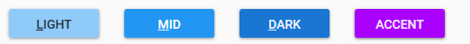

## Add Aesthetically Appealing Material Design to Your Windows Presentation Framework Applications

Estimated reading time: 5 minutes

[Material Design In XAML](https://materialdesigninxaml.net/) (MDIX) is a beautiful theme library that brings [Google’s Material Design](https://material.io/design/) to your Windows Presentation Framework (WPF) applications. In this tutorial, we look at how easy it is to get started and add some beautiful material design to your application.

If you have an existing WPF project, you can skip to step two.

### Contents

- [Add Aesthetically Appealing Material Design to Your Windows Presentation Framework Applications](#h-add-aesthetically-appealing-material-design-to-your-windows-presentation-framework-applications)
    - [Step 1: Create a WPF Project](#h-step-1-create-a-wpf-project)
    - [Step 2: Add the Material Design in XAML NuGet](#h-step-2-add-the-material-design-in-xaml-nuget)
    - [Step 3: Include the Theme Resources in App.xaml](#h-step-3-include-the-theme-resources-in-app-xaml)
    - [Step 4: Setup the Defaults](#h-step-4-setup-the-defaults)
    - [Step 5 (optional): Beyond the Default Styles](#h-step-5-optional-beyond-the-default-styles)
    - [FAQ](#h-faq)
    - [Want More?](#h-want-more)

### Step 1: [Create a WPF Project](https://docs.microsoft.com/en-us/dotnet/framework/wpf/getting-started/walkthrough-my-first-wpf-desktop-application#create-the-application-project)

From Visual Studio, select File > New > Project.  
Then, under the Installed category, expand either the Visual C# or Visual Basic node and then select Windows Classic Desktop.  
Select the WPF App (.NET Framework) template, give the project a name then select OK.

### Step 2: Add the Material Design in XAML NuGet

[Open the Package Manager](https://docs.microsoft.com/en-us/nuget/quickstart/install-and-use-a-package-in-visual-studio) and add the [MaterialDesignThemes](https://www.nuget.org/packages/MaterialDesignThemes/) NuGet package to the WPF project. Markedly, this NuGet package has a dependency on another NuGet package, [MaterialDesignColors](https://www.nuget.org/packages/MaterialDesignColors/). We use this package when selecting the theme colors for the application. At present, the current version of MaterialDesignThemes is 3.1.1

### Step 3: Include the Theme Resources in App.xaml

Two required resource dictionaries need to be [merged into the Application ResourceDictionary](https://docs.microsoft.com/en-us/dotnet/framework/wpf/advanced/merged-resource-dictionaries).

Let’s start with the resource dictionary that provides styles for most of the default WPF controls and custom controls.

<ResourceDictionary Source="pack://application:,,,/MaterialDesignThemes.Wpf;component/Themes/MaterialDesignTheme.Defaults.xaml" />

Then, we need to decide if our app will use the light or dark theme as well as the primary and secondary colors. The simplest option is to use one of the built-in themes provided by the `BundledTheme` resource dictionary. We will add the appropriate resource dictionary for the theme and merge it with the previous dictionary we added.

The `BundledTheme` resource dictionary is included in the `materialDesign` xlmns:

<Application x:Class="Example.App"
             xmlns="http://schemas.microsoft.com/winfx/2006/xaml/presentation"
             xmlns:x="http://schemas.microsoft.com/winfx/2006/xaml"
             xmlns:materialDesign="http://materialdesigninxaml.net/winfx/xaml/themes"
             StartupUri="MainWindow.xaml">

Add the resource dictionary and choose colors:

<ResourceDictionary.MergedDictionaries>
                <materialDesign:BundledTheme BaseTheme="Light" PrimaryColor="DeepPurple" SecondaryColor="Lime" />
                <ResourceDictionary Source="pack://application:,,,/MaterialDesignThemes.Wpf;component/Themes/MaterialDesignTheme.Defaults.xaml" />
</ResourceDictionary.MergedDictionaries>

Finally, when done the complete App.xaml should look something like this:

<Application x:Class="Example.App"
             xmlns="http://schemas.microsoft.com/winfx/2006/xaml/presentation"
             xmlns:x="http://schemas.microsoft.com/winfx/2006/xaml"
             xmlns:materialDesign="http://materialdesigninxaml.net/winfx/xaml/themes"
             StartupUri="MainWindow.xaml">
    <Application.Resources>
        <ResourceDictionary>
            <ResourceDictionary.MergedDictionaries>
                <materialDesign:BundledTheme BaseTheme="Light" PrimaryColor="DeepPurple" SecondaryColor="Lime" />
                <ResourceDictionary Source="pack://application:,,,/MaterialDesignThemes.Wpf;component/Themes/MaterialDesignTheme.Defaults.xaml" /> 
            </ResourceDictionary.MergedDictionaries>
        </ResourceDictionary>
    </Application.Resources>
</Application>

If you would prefer to use your own custom colors for the theme, you can do this with the `CustomColorTheme` resource dictionary (also included in the `materialDesign` xlmns). A final App.xaml should look something like this:

<Application x:Class="Example.App"
             xmlns="http://schemas.microsoft.com/winfx/2006/xaml/presentation"
             xmlns:x="http://schemas.microsoft.com/winfx/2006/xaml"
             xmlns:materialDesign="http://materialdesigninxaml.net/winfx/xaml/themes"
             StartupUri="MainWindow.xaml">
    <Application.Resources>
        <ResourceDictionary>
            <ResourceDictionary.MergedDictionaries>
                <materialDesign:CustomColorTheme BaseTheme="Light" PrimaryColor="Aqua" SecondaryColor="DarkGreen" />
                <ResourceDictionary Source="pack://application:,,,/MaterialDesignThemes.Wpf;component/Themes/MaterialDesignTheme.Defaults.xaml" /> 
            </ResourceDictionary.MergedDictionaries>
        </ResourceDictionary>
    </Application.Resources>
</Application>

### Step 4: Setup the Defaults

Most controls in your application pick up the style and color themes from the MDIX library. However, to make the window render the correct colors, we need to set some default properties (you can see an example of this in the [demo application](https://github.com/ButchersBoy/MaterialDesignInXamlToolkit/blob/master/MainDemo.Wpf/MainWindow.xaml)). Set the Background property to the resource MaterialDesignPaper, and TextElement.Foreground to the resource MaterialDesignBody. Additionally, both of these should use DynamicResource so they automatically update if the theme changes.

<Window x:Class="MaterialDesignColors.WpfExample.MainWindow"
        xmlns="http://schemas.microsoft.com/winfx/2006/xaml/presentation"
        xmlns:x="http://schemas.microsoft.com/winfx/2006/xaml"
        Background="{DynamicResource MaterialDesignPaper}"
        TextElement.Foreground="{DynamicResource MaterialDesignBody}">
    ...
</Window>

### Step 5 (optional): Beyond the Default Styles

Many of the controls in the MDIX library have additional styles beyond the defaults. There is a [demo application](https://github.com/ButchersBoy/MaterialDesignInXamlToolkit/tree/master/MainDemo.Wpf) in the repository with examples of the various styles and controls that are available. Click the button () next to the element to view the corresponding code for it. Also, you can find pre-compiled versions of the demo application on the [releases page](https://github.com/ButchersBoy/MaterialDesignInXamlToolkit/releases).

Let’s use a button as an example. By default, buttons use the primary color theme for display. We can quickly change it to use one of the other theme colors.

Style keys from left to right: MaterialDesignRaisedLightButton, MaterialDesignRaisedButton, MaterialDesignRaisedDarkButton, MaterialDesignRaisedAccentButton.

Let’s change the button to use the accent color.

Most importantly, we must include these styles because they are not automatically referenced in the XAML. To clarify, this, in general, is done at the root of your XAML (typically a Window, UserControl, or ResourceDictionary). All of the additional styles are located in the MaterialDesignThemes package under “/Themes/MaterialDesignTheme.<control type>.xaml”. [Here](https://github.com/ButchersBoy/MaterialDesignInXamlToolkit/tree/master/MaterialDesignThemes.Wpf/Themes) is a complete list.

First, we include the additional button styles by merging the resource dictionary.

<Window.Resources>
    <ResourceDictionary>
        <ResourceDictionary.MergedDictionaries>
            <ResourceDictionary Source="pack://application:,,,/MaterialDesignThemes.Wpf;component/Themes/MaterialDesignTheme.Button.xaml" />
        </ResourceDictionary.MergedDictionaries>
    </ResourceDictionary>
</Window.Resources>

Now we can set the style of the button to use the MaterialDesignRaisedAccentButton style.

<Button
    Style="{StaticResource MaterialDesignRaisedAccentButton}"
    Width="100"
    Content="ACCENT"/>

In this tutorial, we saw how easy it is to integrate Material Design in XAML into a WPF application. I have been working with, and contributing to this library for over a year and have loved the results.

### FAQ

**Why is there no style for the TabControl?**

There is a separate library, [Dragablz](https://github.com/ButchersBoy/Dragablz), from the same [author](https://github.com/ButchersBoy) that provides a tab control along with the additional functionality for moving the tabs around as well. You can see an example of integrating the two libraries in an example app in the GitHub repository [here](https://github.com/ButchersBoy/MaterialDesignInXamlToolkit/tree/master/MahMaterialDragablzMashUp).

**What about window styles and customizations?**

This library integrates with [MahApps](https://mahapps.com/) to support some of the advanced windowing solutions. You can see an example of integrating the two libraries [here](https://github.com/ButchersBoy/MaterialDesignInXamlToolkit/tree/master/MahMaterialDragablzMashUp).

**Where can I get additional help?**

There are several resources available. There is a [wiki](https://github.com/ButchersBoy/MaterialDesignInXamlToolkit/wiki), [gitter chat room](https://gitter.im/ButchersBoy/MaterialDesignInXamlToolkit), and as always, Stack Overflow (with tag [material-design-in-xaml](https://stackoverflow.com/questions/tagged/material-design-in-xaml)). Additionally, [I maintain a repository](https://github.com/Keboo/MaterialDesignInXaml.Examples) with lots of small example projects. Let me know what examples you would like to see.

### Want More?

Check out my blog _[Material Design in XAML - How to make sense of the Dialog Host](/material-design-in-xaml-dialog-host/)_.

