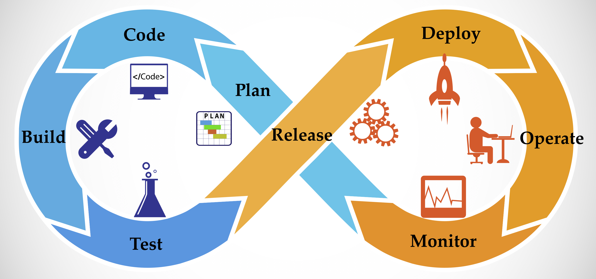

## Is your team ready for DevOps?

## 

DevOps, or Development and Operations, is the integration of the people, process and tools required to deliver high-quality software in an agile manner from concept all the way to production.

In its simplest terms, these practices holds a development team and operations team together so that they understand what each other is doing, and as a result, become more effective and efficient. This enables them to deliver higher quality software faster.

DevOps evolved from Agile Lifecycle Management which evolved from Application Lifecycle Management. Nearly every project at IntelliTect includes at least some DevOps and its related practices. [Click here](/developmentprocess/) to learn about our development process.

Managing a product backlog, source code management, automated unit and integration testing, continuous integration, and deployment through automated builds and releases are the building blocks of continuous integration and development (CI/CD).

## Just Want to Code? Consider this:

We encounter teams that don't want to be bothered with an agile mindset; they just want to code. In our view, DevOps practices, including writing unit tests is a critical part of the coding process.

Stakeholders and sponsors, when given a choice, and without proper perspective, may resist spending money on "DevOps" because it's not code or a feature providing benefit to users. Strategic and well-directed investments in agile tooling and practices will see a return on the investment in very short order, often within weeks and enables teams to deliver features to customers more quickly. With this process, faster returns can be seen on software development investments.

IntelliTect has implemented and used DevOps related technologies from a wide variety of vendors and open source components. Our default tools are Microsoft Visual Studio-based, and we are one of a select few Microsoft Partners assisting Microsoft Enterprise TFS and VSTS clients as part of Microsoft’s DevOps FastTrack program.

## Interested in Taking Your First DevOps Steps?

IntelliTect helps our clients get started on their journey. Check out our DevOps services page to get started.

Want to dig deeper? Check out Mark's PowerPoint presentation on DevOps [here,](https://intellitect.com/devops-presentation-reality-or-fiction/) where he covers DevOps in more depth.

Have a question? Ask in the comments.
