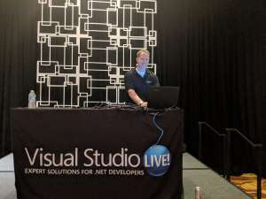

### Can't satisfy your thirst for C# knowledge?

### Hang around Mark Michaelis long enough and you'll get up to speed in no time!

Mark has been traveling within the US, and as far as Scandinavia, spreading the C# love. You might have seen him at Visual Studio LIVE! events in Chicago or San Diego or at .Net User Group meetups in Spokane or Seattle.

His passion for .Net is unwavering. Mark's [Essential C# 7.0 book](/essentialcsharp/) was released a few months ago, but on his quest to stay keep the curious current, he is now speaking on the ins and outs of the potential features of 8.0.

Didn't get to attend one of his speaking engagements? Here's a recording of his talk at the September 2018 meetup of the Spokane .Net User Group.

 

https://youtu.be/c5nsvjQ1I\_g

### Want more? Here are the slides from his talks.

[Essential C# 8 Slides](https://intellitect.com/wp-content/uploads/2018/10/EssentialCsharp8Slides.pdf)

### Have a specific question about C# 8.0?

Ask in the comments.
