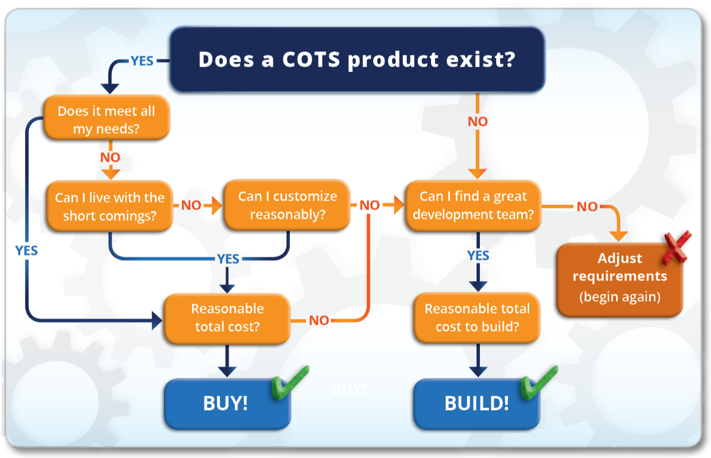

Over the years, I’ve had the opportunity to make the important ‘buy or build’ decision many times. In retrospect, some commercial off-the-shelf (COTS) products have worked out wonderfully. Others have been less than stellar. I use the following matrix to help make my decision.

## Here are some key points to consider for your decision.

### 1 - Make sure you understand your functional and non-functional requirements.

- Functional requirements are about what the software can do.
- Non-functional requirements include things like update support, DevOps and security.
- Both are critically important to evaluate.

### 2 - If you choose to buy, be quick to configure and slow to customize.

- Configuration is done with data.
- Customization is done with code.

### 3 - Carefully examine the effort required, and ongoing work needed, to get the software usable for your organization.

- If buying - Remember COTS solutions have limitations.
- If building - Be prepared for the investment of time and effort needed to create a viable solution.
- Both will likely require ongoing work.

### 4 - Make sure to count all costs including integration, training and deployment. Consider how they will vary with a COTS vs. custom solution.

- How will this software interface with your existing applications? Integrations can be costly and rarely work out-of-the-box for anything but the simplest use cases.
- Deploying software, including validating configurations and training users, can be very expensive and is often overlooked. Account for lost productivity to the business while users are trained on new processes and while software is deployed.
- Good custom software can, when done right, level out the learning curve with incremental/continuous improvements and deployments.

### 5 - When customizing, search high and low for the right developers for your product.

- Don't just consider the big players in a space.
- Remember that a smaller company can provide a more tailored solution for a niche market at a much lower price point.

### 6 - Consider future license, upgrade and development fees. Most software has hidden costs in the later years of a contract. Ensure you are still getting value from the solution in spite of those costs. This applies to both COTS and custom software. If you have an on-premise solution, all upgrades have a price, and for large enterprises, they are rarely trivial.

At IntelliTect, we have many years of experience not only with building software but also with deploying commercial enterprise solutions. We can you help you identify and weigh the total costs as well as benefits of your options. Your choice may not be easy, but you can proceed with confidence.

[Click here](/developmentprocess/) to learn about our development process.

The perfect peach is never ripe when you pick it, neither is software. With a good decision followed by a well-honed process, you’ll have a great peach cobbler and a stellar software product, when you’re done.

Still have questions? Ask in the comments.

###### [Sign up for our quarterly newsletter](https://bit.ly/2Nhro9T) 
