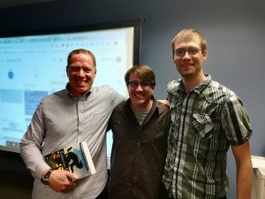

## Eastern Washington University has Three New Adjunct Professors

\[caption id="attachment\_34878" align="alignleft" width="461"\] Three of Eastern Washington’s newest adjunct professors (pictured from left to right - Mark Michaelis, Michael Stokesbarry and Kevin Bost) pose with their textbook, written by Mark.\[/caption\]

For the past two quarters, three of our IntelliTect team members, Mark Michaelis (CEO), Kevin Bost (senior software engineer) and Michael Stokesbary (senior software architect and trainer), have been teaching the programming language C# (pronounced “C Sharp”) to tomorrow’s engineers in the computer science program at Eastern.

“At least in Spokane, the majority of companies developing software are doing so in C#,” said Mark. “This, coupled with Eastern’s mission to prepare students for careers in Spokane, teaching C# seems like a great fit. More importantly, however, the team of IntelliTect adjunct professors is spending lots of time on the real-world skills needed for software engineering, covering topics like Git, unit testing, DevOps and more.”

Joseph Riddle, a senior computer science student at Eastern said, “I took this class because I knew Mark would be teaching it, and I knew I’d get more out of it because of that,” “He doesn’t need to teach. Mark could make more money somewhere else, but it seems like they care about helping students.”

When pressed to explain why he teaches at Eastern, Mark said, “Teaching at the university provides me an opportunity to encourage students in my passion for software engineering. I am humbled that they continue to show up week after week and it is my hope that their dedication to learning will provide them with a great foundation in their careers once they graduate.”

\[caption id="attachment\_34879" align="alignright" width="424"\] Mark prepares the advanced C# class for a group project.\[/caption\]

Raymond Shiner, a fifth-year computer science and philosophy student at Eastern said, “A professor tells me ‘this is how it’s done’ but Mark says ‘this is how we do it every day, We’re actually learning stuff that’s hugely relevant and are moving a step from the theoretical to the practical.”

Our new IntelliTect adjunct professors have prompted multiple students to apply to work at IntelliTect as interns or as engineers. “We have encountered several students this year that we are excited to work with and who seem to be attracted to the challenge that IntelliTect provides,” Mark said. “Uniting this with our ability to ensure they have the software development foundation we expect from a graduate, means we are hiring more students this year than ever before, and I am excited to see where this takes us.”

\[caption id="attachment\_34883" align="alignleft" width="150"\] Mark works with student, Raymond Shiner, on an assignment.\[/caption\]

“There’s this thing about Mark, Kevin, Allen… their drive to be a part of something great and still be excited about learning,” Raymond said. “It’s what makes me hopeful to work here.”

This experience has been a benefit to IntelliTect, since our engineers pass on valuable information that they know is required for success, but it isn’t the reason we do what we do.

“My dad and I used to spend hours working on computers,” said Michael. “He helped stir up my passion and encouraged me to turn my programming hobby into a career. After I started working, I realized I would love to pass on that passion. If I am able to spark that same interest in others by teaching courses at local universities, it’s totally worth the effort.”

Kevin agreed. “I was very blessed to have experienced teachers pour into me and teach me. I love teaching because it’s fun. I love seeing that lightbulb moment when the students finally get it. And, to some degree, I want to try and be that same type of teacher that I was so blessed to have.”

###### [Sign up for our quarterly newsletter](https://bit.ly/2Nhro9T)

