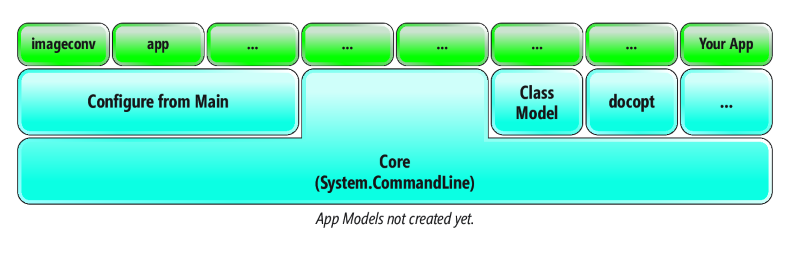

Going all the way back to. NET Framework 1.0, I’ve been astounded that there’s been no simple way for developers to parse the command line of their applications. Applications start execution from the Main method, but the arguments are passed in as an array (string\[\] args) with no differentiation between which items in the array are commands, options, arguments and the like.

I wrote about this problem in a previous article (“How to Contribute to Microsoft Open Source Software Projects,” [msdn.com/magazine/mt830359](https://msdn.com/magazine/mt830359)), and described my work with Microsoft’s Jon Sequeira. Sequeira has lead an open source team of developers to create a new command-line parser that can accept command-line arguments and parse them into an API called System.CommandLine, which does three things:

- Allows for the configuration of a command line.
- Enables parsing of command-line generic arguments (tokens) into distinct constructs, where each word on the command line is a token. (Technically, command-line hosts allow for the combining of words into a single token using quotes.)
- Invokes functionality that’s configured to execute based on the command-line value.

The constructs supported include commands, options, arguments, directives, delimiters and aliases. Here’s a description of each construct:

**Commands**: These are the actions that are supported by the application command line. Consider, for example, `git`. Some of the built-in commands for `git` are `branch`, `add`, `status`, `commit` and `push`. Technically, the commands specified after the executable name are, in fact, subcommands. Subcommands to the root command—the name of the executable itself (for example, `git.exe`)—may themselves have their own subcommands. For instance, the command `dotnet add package` has `dotnet` as the root command, `add` as a subcommand and `package` as the subcommand to `add` (perhaps call it the sub-subcommand?).

**Options**: These provide a way to modify the behavior of a command. For example, the dotnet build command includes the `--no-restore` option, which you can specify to disable the restore command from running implicitly (and instead relying on prior execution of the restore command). As the name implies, options are generally not a required element of a command.

**Arguments**: Both commands and options can have associated values. For example, the `dotnet new` command includes the template name. This value is required when you specify the new command. Similarly, options may have values associated with them. Again, with `dotnet new`, the `--name` option has an argument for specifying the name of the project. The value associated with a command or option is called the argument.

**Directives**: These are commands that are cross-cutting for all applications. For example, a redirect command can force all output (stderr and stdout) to go into an .xml format. Because directives are part of the System.CommandLine framework, they’re included automatically, without any effort on the part of the command-line interface developer.

**Delimiters**: The association of an argument to a command or an option is done via a delimiter. Common delimiters are space, colon and the equal sign. For example, when specifying the verbosity of a dotnet build, you can use any of the following three variations: `--verbosity=diagnostic`, `--verbosity diagnostic` or `--verbosity:diagnostic`.

**Aliases**: These are additional names that can be used to identify commands and options. For example, with dotnet, `classlib` is an alias for “Class library” and `-v` is an alias for `--verbosity`.

Prior to System.CommandLine, the lack of built-in parsing support meant that when your application launched, you as the developer had to analyze the array of arguments to determine which corresponded to which argument type, and then correctly associate all of the values together. While .NET includes numerous attempts at solving this problem, none has emerged as a default solution, and none scales well to support both simple and complex scenarios. With this in mind, System.CommandLine was developed and released in alpha form (see [github.com/dotnet/command-line-api](https://github.com/dotnet/command-line-api)).

### Keep Simple Things Simple

Imagine that you’re writing an image conversion program that converts an image file to a different format based on the output name specified. The command line could be something like this:

imageconv --input sunrise.CR2 --output sunrise.JPG

Given this command line (see “Passing Parameters to the .NET Core Executable” for alternative command-line syntax), the `imageconv` program will launch into the Main entry point, `static void Main(string[] args)`, with a string array of four corresponding arguments. Unfortunately, there’s no association between `--input` and `sunrise.CR2` or between `--output` and `sunrise.JPG`. Neither is there any indication that `--input` and `--output` identify options.

Fortunately, the new System.CommandLine API provides a significant improvement on this simple scenario, and does so in a way I haven’t previously seen. The simplification is that you can program a Main entry point with a signature that matches the command line. In other words, the signature for Main becomes:

static void Main(string input, string output)

That’s right, System.CommandLine enables the automatic conversion of the `--input` and `--output` options into parameters on Main, replacing the need to even write a standard `Main(string[] args)` entry point. The only additional requirement is to reference an assembly that enables this scenario. You can find details on what to reference at [itl.tc/syscmddf](https://itl.tc/syscmddf), as any instructions provided here are likely to be quickly dated once the assembly is released on NuGet. (No, there’s no language change to support this. Rather, when adding the reference, the project file is modified to include a build task that generates a standard Main method with a body that uses reflection to call the “custom” entry point.)

Furthermore, arguments aren’t limited to strings. There’s a host of built-in converters (and support for custom converters) that allow you, for example, to use System.IO.FileInfo for the parameter type on input and output, like so:

static void Main(FileInfo input, FileInfo output)

As described in the article section, “System.CommandLine Architecture,” System.CommandLine is broken into a core module and an app provider module. Configuring the command line from Main is an App Model implementation, but for now I’ll just refer to the entire API set as System.CommandLine.

The mapping between command-line arguments and Main method parameters is basic today, but still relatively capable for lots of programs. Let’s consider a slightly more complex imageconv command line that demonstrates some of the additional features. Figure 1 displays the command-line help.

**Figure 1 Sample Command Line for imageconv**

imageconv:
  Converts an image file from one format to another.
Usage:
  imageconv \[options\]
Options:
  --input          The path to the image file that is to be converted.
  --output         The target name of the output after conversion.
  --x-crop-size    The X dimension size to crop the picture.
                   The default is 0 indicating no cropping is required.
  --y-crop-size    The Y dimension size to crop the picture.
                   The default is 0 indicating no cropping is required.
  --version        Display version information

The corresponding Main method that enables this updated command line is shown in Figure 2. Even though the example has nothing more than a fully documented Main method, there are numerous features enabled automatically. Let’s explore the functionality that’s built-in when you use System.CommandLine.

**Figure 2 Main Method Supporting the Updated imageconv Command Line**

/// 

/// Converts an image file from one format to another.
/// 

/// <param name="input">The path to the image file that is to be converted.</param>
/// <param name="output">The name of the output from the conversion.</param>
/// <param name="xCropSize">The x dimension size to crop the picture. The default is 0 indicating no cropping is required. </param>
/// <param name="yCropSize">The x dimension size to crop the picture. The default is 0 indicating no cropping is required </param>
public static void Main( FileInfo input, FileInfo output, int xCropSize = 0, int yCropSize = 0)

The first bit of functionality is the help output for the command line, which is inferred from the XML comments on Main. These comments not only allow for a general description of the program (specified in the summary XML comment), but also for the documentation on each argument using parameter XML comments. Leveraging the XML comments requires enabling doc output, but this is configured automatically for you when referencing the assembly that enables configuration via Main. There’s built-in help output with any of three command-line options: -h, -?, or --help. For example, the help displayed in **Figure 1** is automatically generated by System.CommandLine.

Similarly, while there’s no version parameter on Main, System.CommandLine automatically generates a --version option that outputs the assembly version of the executable.

Another feature, command-line syntax verification, detects if a required argument (for which no default is specified on the parameter) is missing. If a required argument isn’t specified, System.Command­Line automatically issues an error that reads, “Required argument missing for option: --output.” Although somewhat counterintuitive, by default options with arguments are required. However, if the argument value associated with an option isn’t required, you can leverage C# default parameter value syntax. For example:

int xCropSize = 0

There’s also built-in support for parsing options regardless of the sequence in which the options appear on the command line. And it’s worth noting that the delimiter between the option and the argument may be a space, a colon or an equal sign by default. Finally, Camel casing on Main’s parameter names is converted to Posix-style argument names (that is, xCropSize translates to --x-crop-size on the command line).

If you type an unrecognized option or command name, System.CommandLine automatically returns a command-line error that reads, “Unrecognized command or argument ….” However, if the name specified is similar to an existing option, the error will prompt with a typo correction suggestion.

There are some built-in directives available to all command-line applications that use System.CommandLine. These directives are enclosed in square brackets and appear immediately following the application name. For example, the \[debug\] directive triggers a breakpoint that allows you to attach a debugger, while \[parse\] displays a preview of how tokens are parsed, as shown here:

imageconv \[parse\] --input sunrise.CR2 --output sunrise.JPG

In addition, automated testing via an IConsole interface and TestConsole class implementation is supported. To inject the TestConsole into the command-line pipeline, add an IConsole parameter to Main, like so:

public static void Main(
  FileInfo input, FileInfo output,
  int xCropSize = 0, int yCropSize = 0,
    IConsole console = null)

To leverage the console parameter, replace invocations to System.Console with the IConsole parameter. Note that the IConsole parameter will be set automatically for you when invoked directly from the command line (rather than from a unit test), so even though the parameter is assigned null by default, it shouldn’t have a null value unless you write test code that invokes it that way. Alternatively, consider putting the IConsole parameter first.

One of my favorite features is support for tab completion, which end users can opt into by running a command to activate it (see [bit.ly/2sSRsQq](https://bit.ly/2sSRsQq)). This is an opt-in scenario because users tend to be protective of implicit changes to the shell. Tab completion for options and command names happens automatically, but there’s also tab completion for arguments via suggestions. When configuring a command or option, the tab completion values can come from a static list of values, such as the q, m, n, d or diagnostic values of --verbosity. Or they can be dynamically provided at run time, such as from REST invocation that returns a list of available NuGet packages when the argument is a NuGet reference.

Using the Main method as the specification for the command line is just one of several ways that you can program using System.CommandLine. The architecture is flexible, allowing other ways to define and work with the command line.

### The System.CommandLine Architecture

System.CommandLine is architected around a core assembly that includes an API for configuring the command line and a parser that resolves the command-line arguments into a data structure. All the features listed in the previous section can be enabled via the core assembly, except for enabling a different method signature for Main. However, support for configuring the command line, specifically using a domain-specific language (such as a Main like method) is enabled by an app model. (The app model used for the Main like method implementation described earlier is code-named “DragonFruit.”) However, the System.CommandLine architecture enables support for additional app models (as shown in **Figure 3**).

**Figure 3 System.CommandLine Architecture**

For example, you could write an app model that uses a C# class model to define the command-line syntax for an application. In such a model, property names might correspond to the option name and the property type would correspond to the data type into which to convert an argument. In addition, the model might leverage attributes to define aliases, for example. Alternatively, you could write a model that parses a docopt file (see [docopt.org](https://docopt.org)) for the configuration. Each of these app models would invoke the System.CommandLine configuration API. Of course, developers might prefer to call System.CommandLine directly from their application rather than via an app model, and this approach is also supported.

### Passing Parameters to the .NET Core Executable

When specifying command-line arguments in combination with the dotnet run command, the full command line would be:

dotnet run --project imageconv.csproj -- --input sunrise.CR2  --output sunrise.JPG

If you’re running dotnet from the same directory in which the csproj file was located, however, the command line would read:

dotnet run -- --input sunrise.CR2 --output sunrise.JPG

The dotnet run command uses the “--” as the identifier, indicating that all other arguments should be passed to the executable for it to parse.

Starting with .NET Core 2.2, there’s also support for self-contained applications (even on Linux). With a self-contained application, you can launch it without using dotnet run and instead just rely on the resulting executable, like so:

imageconv.exe --input sunrise.CR2 --output sunrise.JPG

Obviously, this is expected behavior to Windows users.

### Making the Complex Possible

Earlier, I mentioned that the functionality for keeping simple things simple was basic. This is because enabling command-line parsing via the Main method still lacks some features that some might consider important. For example, you can’t configure a (sub) command or an option alias. If you encounter these limitations, you can build your own app model or call into the Core (System.CommandLine assembly) directly.

System.CommandLine includes classes that represent the constructs of a command line. This includes Command (and RootCommand), Option and Argument. **Figure 4** provides some sample code for invoking System.CommandLine directly and configuring it to accomplish the basic functionality defined in the help text of **Figure 1**.

**Figure 4 Working with System.CommandLine Directly**

using System;
using System.CommandLine;
using System.CommandLine.Invocation;
using System.IO;
// etc...

public static async Task<int> Main(params string\[\] args)
{
  RootCommand rootCommand = new RootCommand(
    description: "Converts an image file from one format to another.",
    treatUnmatchedTokensAsErrors: true);

  Option inputOption = new Option(
    aliases: new string\[\] { "--input", "-i" },
    description: "The path to the image file that is to be converted.",
    argument: new Argument<FileInfo>());
  rootCommand.AddOption(inputOption);

  Option outputOption = new Option(
    aliases: new string\[\] { "--output", "-o" },
    description: "The target name of the output file after conversion.",
    argument: new Argument<FileInfo>());
  rootCommand.AddOption(outputOption);

  Option xCropSizeOption = new Option(
    aliases: new string\[\] { "--x-crop-size", "-x" },
    description: "The x dimension size to crop the picture. The default is 0 indicating no cropping is required.",
    argument: new Argument<FileInfo>());
  rootCommand.AddOption(xCropSizeOption);

  Option yCropSizeOption = new Option(
    aliases: new string\[\] { "--y-crop-size", "-y" },
    description: "The Y dimension size to crop the picture. The default is 0 indicating no cropping is required.",
    argument: new Argument<FileInfo>());
  rootCommand.AddOption(yCropSizeOption);

  rootCommand.Handler =
    CommandHandler.Create<FileInfo, FileInfo, int, int>(Convert);

  return await rootCommand.InvokeAsync(args);
}

public static void Convert(FileInfo input, FileInfo output, int xCropSize = 0, int yCropSize = 0)
{
  // Convert...
}

In this example, rather than rely on a Main app model to define the command-line configuration, each construct is instantiated explicitly. The only functional difference is the addition of aliases for each option. Leveraging the Core API directly, however, provides more control than what’s possible with the Main like approach.

For example, you could define subcommands, like an image-­enhance command that includes its own set of options and arguments related to the enhance action. Complex command-line programs have multiple subcommands and even sub-subcommands. The dotnet command, for example, has the dotnet sln add command, where dotnet is the root command, sln is one of the many subcommands, and add (or list and remove) is a child command of sln.

The final call to InvokeAsync implicitly sets up many of the features automatically including:

- Directives for parse and debug.
- The configuration of the help and version options.
- Tab completion and typo corrections.

There are also separate extension methods for each feature if finer-grain control is necessary. There are also numerous other configuration capabilities exposed by the Core API. These include:

- Handling tokens that are explicitly unmatched by the configuration.
- Suggestion handlers that enable tab completion, returning a list of possible values given the current command-line string and the location of the cursor.
- Hidden commands that you don’t want to be discoverable using tab completion or help.

In addition, while there are lots of knobs and buttons to control the command-line parsing with System.CommandLine, it also provides a method-first approach. In fact, this is what’s used internally to bind to the Main like method. With the method-first approach you can use a method like Convert at the bottom of **Figure 4** to configure the parser (as shown in **Figure 5**).

**Figure 5 Using Method-First Approach to Configure System.CommandLine**

public static async Task<int> Main(params string\[\] args)
{
  RootCommand rootCommand = new RootCommand(
    description: "Converts an image file from one format to another."
    , treatUnmatchedTokensAsErrors: true);
  MethodInfo method = typeof(Program).GetMethod(nameof(Convert));
  rootCommand.ConfigureFromMethod(method);
  rootCommand.Children\["--input"\].AddAlias("-i");
  rootCommand.Children\["--output"\].AddAlias("-o");
  return await rootCommand.InvokeAsync(args);
}

In this case, notice that the Convert method is used for the initial configuration and then you navigate the root command’s object model to add aliases. The Children indexable property contains all the options and commands attached to the root command.

### Wrapping Up

I’m very excited about the functionality available in System.CommandLine. The fact that achieving the simple scenarios explored here requires so little code is marvelous. Furthermore, the amount of functionality achieved—including things like tab completion, argument conversion and automated testing support, just to name a few—means that with little effort you can have a fully functioning command-line support in all of your dotnet applications.

Finally, System.CommandLine is open source. That means if there’s functionality missing that you require, you can develop the enhancement and submit it back to the community as a pull request. A couple things I would personally love to see added are support for not always specifying the option or command names on the command line and relying instead on the position of the arguments to imply what the names are. Additionally, it would be great if you could declaratively add an additional alias (such as short aliases) when using the Main like or method-first approach.

_Thanks to the following Microsoft technical experts for reviewing this article: Kevin Bost, Kathleen Dollard, Jon Sequeira_

_This article was originally posted_ [_here_](https://docs.microsoft.com/en-us/archive/msdn-magazine/2019/march/net-parse-the-command-line-with-system-commandline) _in the March 2019 issue of MSDN Magazine._
