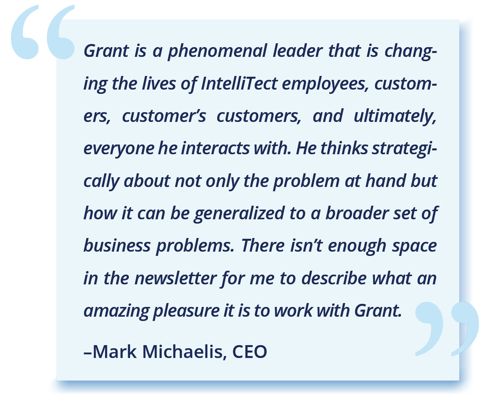

## A Puzzler Who Uses Software to Maximize Relationships

**_Whether you’ve worked with them for years or have never met our featured employee, this column will continue to introduce you to the many faces of IntelliTect. For this issue, we featured a developer with a keen sense for solving complex puzzles: Grant Erickson, CTO._**

\[caption id="attachment\_33254" align="alignleft" width="300"\] [Grant Erickson](/grant-erickson/)IntelliTect CTO.\[/caption\]

Grant’s desk is littered with little puzzles and brain teasers—Rubix cubes, twisty obstacles, handheld mazes—and he’s solved them all. Well, most of them, anyway. Dozens of coworkers have attempted and mastered the puzzles, as well. To prove it, they’ve added their names on the sign-out sheets that line the walls of his cubicle. But to Grant, those puzzles aren’t a distraction; they help his mind wander just enough so that somehow, he also finds the answer to his work problem of the moment. Grant has solved several puzzles this way, and it’s how he’s been able to create several of IntelliTect’s products.

“We thrive on delivering products that people love to use,” Grant said. “For me, knowing that people use my software daily, and it makes their life easier, that makes me happy.”

For Grant, the love of software started in kindergarten, when his family got an Atari 800 computer. He was writing simple programs in third grade and by sixth grade, he had entered the science fair with a hardware/software solution to digitize drawings. In high school, Grant was paid to build a program to track inventory at a local store.

Later in life, Grant coupled his love for programming with his passion for bettering people’s lives. Kevin Finch, founder of the nonprofit, Big Table, reached out to Grant. Together, they created a CRM website based around relationships specifically designed to care for people in the hospitality industry.

Not much later, Grant was helping his daughter’s youth group at a fundraising event and he thought, “I could automate this process.” So he created auctionrunner.org—an easy-to-use auction website that nonprofits could use to run silent auctions.

Several of IntelliTect’s products were born this way. The ones that focus on improving a person’s situation—like IntelliTect’s philanthropic projects with the Vanessa Behan Crisis Nursery—that bring Grant the most joy. To solve their puzzle, Grant asked himself, “how do we think holistically about the entire process of a child being cared for by the staff at Vanessa Behan and how do we use the computer software to maximize relationships and minimize the paperwork?”

When not solving puzzles at work, Grant is at home with his family. His parents live in the house on one side of him; his in-laws, the other. Between the three families, they maintain several acres of produce and even raise a few cows.

People may be surprised to know that Grant is also the worship arts director at his church. Many Sundays, you can find his entire family on stage, each playing their own instrument.

\[caption id="attachment\_35237" align="aligncenter" width="1024"\] Grant and his entire family are helping lead music with the rest of the team.\[/caption\]

“I enjoy helping people and seeing people live better lives (no matter where I’m at),” Grant said. “And, I love writing software that people use to become more productive so they can maximize the time they’re spending to help others.”

Who should be our next Spotlight Employee? Comment below.

###### [Sign up for our quarterly newsletter](https://bit.ly/2Nhro9T) 
