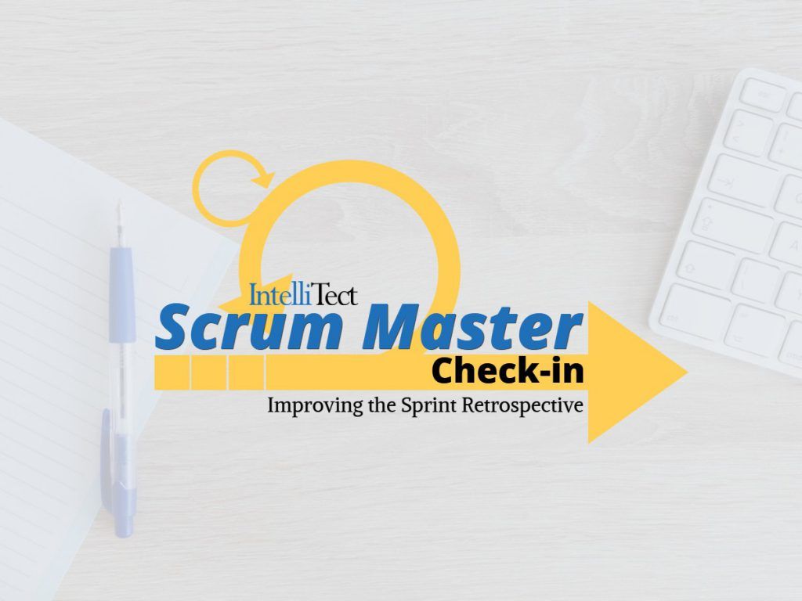

## 

## Simple tricks to improve the Sprint retrospective.

### **New to Scrum? No problem.**

Scrum is an agile methodology that allows developers to create working software early and often. Scrum Masters are servant leaders; we seek to guide one or many agile development teams through the Scrum process by facilitating Scrum ceremonies, removing team impediments, and orchestrating continuous improvement. It is our goal to enable our team to be self-organizing and ‘agile’ in how they handle requested changes. For a basic understanding of how we utilize Scrum at Intellitect, check out [our development process](/developmentprocess/).

As fellow Scrum Masters and others involved in the Scrum process know, these concepts are presented in the [Scrum Guide](https://www.scrum.org/resources/scrum-guide), providing the framework by which Scrum should be implemented. If you’re new to Scrum, start with the guide. These concepts are crucial to the Scrum process of building a truly effective and self-organizing Scrum team. In the words of Scrum creators Ken Schwaber and Jeff Sutherland:

> “Scrum’s roles, events, artifacts, and rules are immutable and although implementing only parts of Scrum is possible, the result is not Scrum. Scrum exists only in its entirety and functions well as a container for other techniques, methodologies, and practices.”

This blog series will examine the Scrum Ceremonies. I’ll review each of these meetings individually to reiterate their importance and share facilitation tips and tricks to build trust and improve processes in your team. In this first blog, I will focus on the Sprint Retrospective. As we know, the retrospective is the first step to our next sprint.

### **The Sprint Retrospective**

This is a chance for the team to look back on the last sprint, an opportunity to review the good, the bad and the ugly of the previous sprint before moving into the next one. This review is important because it allows the team to:

1. Identify and discuss challenges encountered by the team during the sprint
2. Collaborate on solutions to improve efficiency, process and team satisfaction
3. Recognize key focus areas for developing the team’s next sprint goal.

All of this drives the iterative improvement that is key to Scrum. It is vital that the Scrum team recognizes this meeting as a safe and open space for them to share. Trust is paramount within the team in general, but this is particularly true during Sprint Retrospectives. The team must feel as though they can share their struggles with you and the rest of their team. Without trust, an opportunity to safely identify the real root problem and the opportunity to contribute to a solution, the Scrum team may find themselves solving the wrong problems, facing repeated problems and/or struggling with job dissatisfaction. Therefore, it is critical for the Scrum Master to help foster this trust, and determine how best to meet the team’s needs.

### **Simple Ways to Cultivate Trust**

One way I like to build trust within the dev team, during Sprint Retrospectives, is to start the meeting with a chance for each team member to share with the team the important events and changes in their personal lives. This allows the team members to get to know one another on a personal level and helps to foster fellowship. I find this to be particularly true with co-located teams. Without the daily in-person interaction and the inability for organic, ad hoc (hallway) conversations to occur, it can be difficult for trust and familiarity to develop.

When introducing this technique to your team, you may find that some team members are reluctant to share or are unsure of what to share. For this reason, you must also be willing and ready to share things from your own life. If you lead by example, the team will naturally fall into the process. They will find it easier to share with each successive meeting.

Another way I have found to develop trust is to lighten the mood of the meeting by including a short game, such as trivia, to the beginning of the meeting. This is not meant to be a serious competition and may feel a bit cheesy or inefficient, but it’s an important chance for team members to break out of their shells and bond as part of a unified team. It can also become a reason for team members to look forward to the meeting.

Those are just a few ways I like to promote trust in my teams’ Sprint Retrospective meetings. Every team is different. It’s a Scrum Master’s job to ascertain these differences then determine how to provide the best environment for their team. Our efforts promote trust, efficiency and improvement.

### **How do You Foster Trust in Your Team?**

If you are looking for a quick way to rate your team’s agility take a look at our [7 Agile Metrics](https://intellitect.com/demystified-agile/).

Continue improving and keep being a great servant leader for your team!
