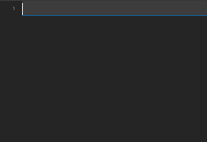

### Learn to use Terraform to manage and scale up architecture of your growing project.

Managing huge amounts of infrastructure can be difficult and time-consuming, especially in an agile development world where requirements continuously change. Using [Infrastructure as Code (IaC)](https://docs.microsoft.com/en-us/dotnet/architecture/cloud-native/infrastructure-as-code) to deploy and scale out environments, while applying proven software development practices, can help alleviate the developer’s burden of hitting an ever-moving target. Just like any good software development project, the structure of the project should scale as needed.

### Consider [Terraform](https://www.terraform.io/) by HashiCorp

Terraform is a reliable infrastructure as code solution. Its syntax ([HCL](https://www.terraform.io/docs/configuration/syntax.html)) is easy for both humans and computers to process. The project is [open source](https://github.com/hashicorp/terraform), [well documented](https://www.terraform.io/docs/index.html), and [actively developed](https://github.com/hashicorp/terraform/releases). It keeps track of dependencies between infrastructure resources, so it’s able to build up all of the infrastructure in an intelligent order. Also, as resources change, where possible, it can update the resources in place.

Terraform is well documented. It's simple to get started with the [Getting Started Guide](https://learn.hashicorp.com/terraform?track=azure#azure).

_Note: For the rest of this article, I’m going to assume you’ve worked through that guide and are comfortable with the basic Terraform commands and have connected it to Azure._

### Setting Up Your Project Structure

Even for simple projects, putting all of your Terraform scripts into a single folder quickly becomes a maintenance nightmare, so let’s look at a different option for keeping your Terraform project organized.

If you currently have a single production environment, chances are, you will eventually want to scale out to a “sandbox environment” where you can test changes before pushing them into production.

### A Default Project Template

For this example, let’s assume your architecture has a single SQL server and you have three environments: dev, test, and prod. In each environment, we will scale out to two [Azure regions](https://azure.microsoft.com/global-infrastructure/regions/).

From the root of the repository, create “env” and “modules” folders, then create a “sql” folder underneath the module’s folder. Underneath the env folder, create folders for each of the environments: dev, test, and prod. Create a “region” folder in each environment’s folder.

Environment folders contain the script files that are unique to each environment. Reference global resources (such as a traffic manager) at this level. Reference resources that are specific to a particular region from within the region module.

All environments utilize the shared SQL module so it exists outside of the environment\-specific folders. So move resources that are shared among multiple environments into a folder within modules. Once achieved, developers can now easily scale-out this basic pattern with more infrastructure beyond just a single SQL server.

#### Follow these Basic Guidelines for Success

Having some basic coding conventions while working in a large project can help standardize the script files and make them easier to work with.

When creating the Terraform script files, there are five conventions that I recommend following:

- The main.tf file stores [local values](https://www.terraform.io/docs/configuration/locals.html) for each module. Typically, only local variables reference [input variables](https://www.terraform.io/docs/configuration/variables.html), and athough the local variables often duplicate the input variables, it separates the external view of the module from its internal implementation.
- Inside of each of the environment folders, there is a providers.tf file that contains the needed [provider references](https://www.terraform.io/docs/providers/azurerm/index.html) in one place while allowing for easy updates.
- [Input variables](https://www.terraform.io/docs/configuration/variables.html) are specified in a vars.tf file for each module.
- [Output values](https://www.terraform.io/docs/configuration/variables.html) are specified in an outputs.tf file for each module.
- Every [call to a module](https://www.terraform.io/docs/configuration/modules.html#calling-a-child-module) is done from within a script file whose name matches the name of the module (Example: calling the region module is done from within the region.tf file).

Following these five basic guidelines can significantly simplify working with your Terraform projects. It also allows for efficient scaling out. In the end, the goal is to have basic script files that can easily manage and scale up your architecture as your project grows.

_Note: Find the complete code for this example [here](https://github.com/IntelliTect/blog-resources/tree/master/terraform-project-structure)._

Now that you're familiar with setting up architecture in Azure, consider leveraging Azure Kubernetes Service (AKS). [Click here](/kubernetes/) for a blog on the basics of Kubernetes.

Do you have any additional guidelines that you use in your Terraform projects? Comment below.
