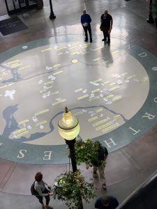

At IntelliTect, we’re proud of our culture and are excited to try out new activities as a team. Josh Ward, an active member of our Culture Club and one of our senior software engineers, regularly organizes mini-lunch game-breaks at the office. In September, he treated an intrepid group of IntelliTect explorers to a very fun scavenger hunt.

We started the event by playing small games as people were arriving. Once everyone was ready, Josh, with a talk-show-host twinkle in his eye, tasked attendees with finding (and taking photos of) various landmarks and items in a relatively small radius around Riverpark Square.

It sounded easy, but a lot of the items were quite challenging to decipher and locate. Everyone seemed to enjoy the challenge and location of the hunt.

After, we wrapped-up the fun with a “Colossus” pizza and a spirited debrief and scoring session. Congrats to team N+1 for their victory!

Thanks to Josh for organizing the event and making it a success!

Recently, I even hosted a PC gaming night for our team. I love that I work for a company that supports our passions, even when they aren’t billable. I hope we have more of these types of events in the future.

### Interested in joining our team?

[Click here](/jobs/) for our current positions.

And if you haven’t yet, sign up today for our quarterly newsletter: [Intellovations](https://bit.ly/2Nhro9T).

