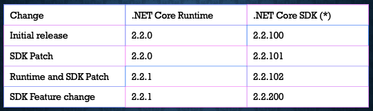

As developers, our "cheese" is constantly moving. Everything is expanding outward, and we must continually study and dissect subjects like .NET Core 3 and C# 8.0, so we aren't left behind.

I discovered my love for writing software on an Atari 800 computer. At the time, the entire system was knowable. I thought that if I studied long enough then I'd know everything I needed to know.

Today that isn't the case. Transistors alone have multiplied from the almost 5000 of my Atari 800 to over two billion on my current laptop. Technology is expanding at a rate that no one person can know "everything."

Without intentionality in learning and relearning at least every three to five years, the industry will pass us by.

So, to help you stay current, here's the **full video** from IntelliTect's Visual Studio 2019 event, where I explain what has arrived in .NET Core 3.0.

<iframe src="https://www.youtube.com/embed/fbmV7M6zHQ4" allowfullscreen width="560" height="315"></iframe>

### A Little Background

Microsoft moved from the .NET full framework, a Windows-only (plus Xamarin and some mono outliers) platform to .NET Core. It's been a cross-platform framework from the beginning.

There were some growing pains in this process, but for the most part, the changes to .NET Core are not revolutionary. Microsoft is simply evolving and growing the .NET Core cross-platform framework through evolutionary change.

Here are some highlights of what we're going to cover:

- C# 8 goodness
- Native JSON
- Entity Framework enhancements
- ASP.NET Core improvements
- Stand-alone executables

### Fundamentals of .NET

<iframe src="https://www.youtube.com/embed/Cg7LISiS85c" allowfullscreen width="560" height="315"></iframe>

#### Versioning

It comes in two flavors - your Core Runtime and your SDK.

**Major**: Significant changes occur to the product or a new product direction. Breaking changes were taken.

**Minor**: Added Public API surface area or added new behavior.

**Patch**: Bug fixes are made. Added support for a newer platform.

#### What About .NET Standard?

It's the common piece between the frameworks. With .NET Standard, you want to use the earliest version and take up the smallest footprint.

### New Features of .NET Core 3

#### Changes to Versions and Linking

<iframe src="https://www.youtube.com/embed/pXzj7OskCtQ" allowfullscreen width="560" height="315"></iframe>

You can now **publish your application as a single file**. When the executable runs, it extracts to your disc and then runs from that location. Subsequent executions do not need to re-extract.

It's a nice way to package applications.

The **publish trimmed** feature is essentially "tree shaking" your app. It removes the extra framework elements that aren't needed for the specific application being published.

#### Compilations, Builds and .NET Core Version

<iframe src="https://www.youtube.com/embed/kSrT-Izb4Fg" allowfullscreen width="560" height="315"></iframe>

Tiered compilation allows for a couple different kinds of compiling while the program is running.

With normal execution, the JITter grabs the code, compiles it as quickly as possible and then runs it. There is a trade-off between speed of compile and speed of execution for the compiler. If more time was spent compiling, then the program would run faster. So, with .NET Core, the compiler runs in the background while the program is running to improve the compiled version of the application. This allows the program to start quickly and then optimize while the application is running.

Additionally, you can now compile native versions of your application for different platforms, but there are limitations. For example, you can't compile a Linux executable on a Windows machine.

Other new changes:

- When you do a build, dependencies are now copied automatically
- You can set your project to automatically roll forward to the next version of .NET which will help keep your project secure and help you exercise your pipelines so that releases run smoothly

#### C# Overlap and .NET Core Support

C# is how many of us code in .NET Core, so if you add something in C#, then .NET Core needs to provide support for that.

<iframe src="https://www.youtube.com/embed/uMO7IQ0wwNs" allowfullscreen width="560" height="315"></iframe>

Here are some new concepts that I found the most interesting and I demo in the above clip.

- Range/Index operators
- Async streams
- IEEE floating-point improvements to help fix many of the rounding errors that regularly occur

#### JSON Goodness

<iframe src="https://www.youtube.com/embed/gQyvDOcMS7g" allowfullscreen width="560" height="315"></iframe>

JSON support has changed to provide a Utf8JsonReader & Utf8JsonWriter to build JSON Parsers. These two core pieces are about two times faster than Json.Net equivalent.

The switch from UFT16 to Utf8 was a simple choice because almost everything coming in off of the web is UTF8, not UFT16. It also reduces the memory footprint by not storing two bytes for every character.

Features and limitations to note:

- JsonDocument: Reader
- JsonSerializer with deserializer
- Newtonsoft.Json has been removed
- Serialization challenges with nullable
- Reference loop handling does not feel 100 percent baked

#### HTTP/2 Support

HTTP/2 is the newest shiny object that does a lot of really cool things like:

- Data compression of HTTP headers
- HTTP/2 Server Push
- Fixing the head-of-line blocking problem in HTTP 1.x
- Multiplexing multiple requests over a single TCP connection. This negotiation is enabled by default
- TLS 1.3 & OpenSSL 1.1.1 on Linux

#### Entity Framework (EF) Core 3.0

<iframe src="https://www.youtube.com/embed/6w8N1-JTago" allowfullscreen width="560" height="315"></iframe>

Link has been reworked for faster, better queries:

- You now get a runtime exception for client-side query evaluation (see above clip)
- dotnet ef tooling: dotnet tool install --global dotnet-ef
- Cosmos DB Support
- Interception of database operations can now happen before or after they return
- EF 6.3 runs on .NET Core 3.0
- Nullability support
- Lazy loading from 2.1 - but this is the devil! Don't use it

#### Other Features to Check Out

- Parts of Blazor are now integrated and allow developers to use C# on both the server and the client-side and render HTML from C#
- gRPC is an option to replace REST and is not JSON. It's contract-based, uses Protobuf over HTTP/2, allows for streaming and is great for building complex RPC type of applications
- SignalR Updates include automatic reconnect on the client and custom authorization
- Identity Server 4
- Certificate Authorization
- IIS exceptions are no longer lost in space. They're now written to Windows Event Log

### C# 8 - Default Interface Implementation

<iframe src="https://www.youtube.com/embed/bn2vGLyQ5YU" allowfullscreen width="560" height="315"></iframe>

C# now allows you to have method implementations inside of your interface, which effectively opens up the polymorphism behaviors. It's not necessarily designed to do that, but it opens the door and saves time and frustration in the implementation process.

_\*Note - this only works in .NET Core - not Full Framework._

### Want More .NET Core?

Who wouldn't? This topic is much more detailed than a single hour talk or short blog can cover. Here's the [link to all the code](https://github.com/IntelliTect-Samples/2019-10-23.VisualStudio2019Launch) for IntelliTect's Visual Studio 2019 event.

For continued learning, consider joining a local .NET Users Group to connect with developers of varying skill levels. [Click here](https://www.meetup.com/Spokane-NET-User-Group/) for the Spokane .NET Users Group meetup page.

There are multiple blogs and videos that can help. Here are some recent blogs that IntelliTect team members have written:

- [Video: What’s New in ASP.NET Core 2.2](https://intellitect.com/video-asp-net-core-2-2/)
- [Docker: Adding PostgreSQL to .Net Core – Part 2](https://intellitect.com/docker-postgresql/)
- [Securing Web APIs in .NET Core 2.2](https://intellitect.com/securing-web-api-dotnetcore-2-2/)
- [Quickly Configure ASP.NET Core API to work with Vue CLI 3!](https://intellitect.com/quickly-configure-asp-net-core-api-to-work-with-vue-cli-3/)
- [ASP.NET Core Dynamic Routing with Constraints](https://intellitect.com/asp-net-core-dynamic-routing-with-constraints/)

Do you have more questions? Feel free to ask me about .NET Core features in the comments.
