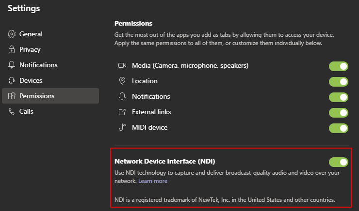
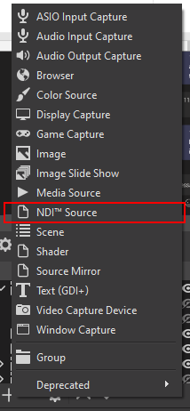
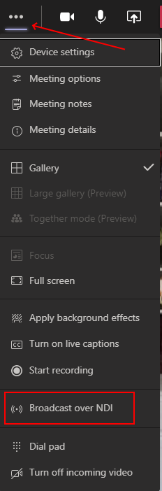
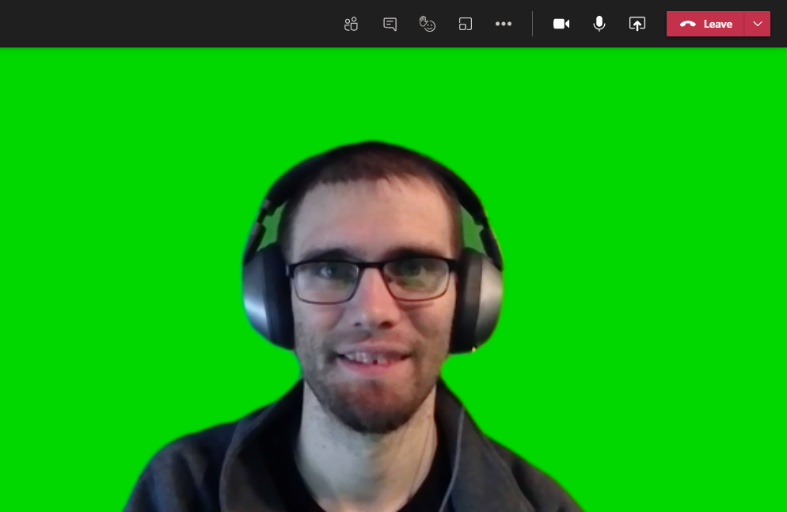
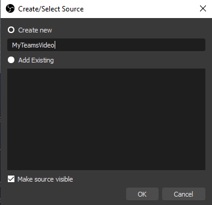
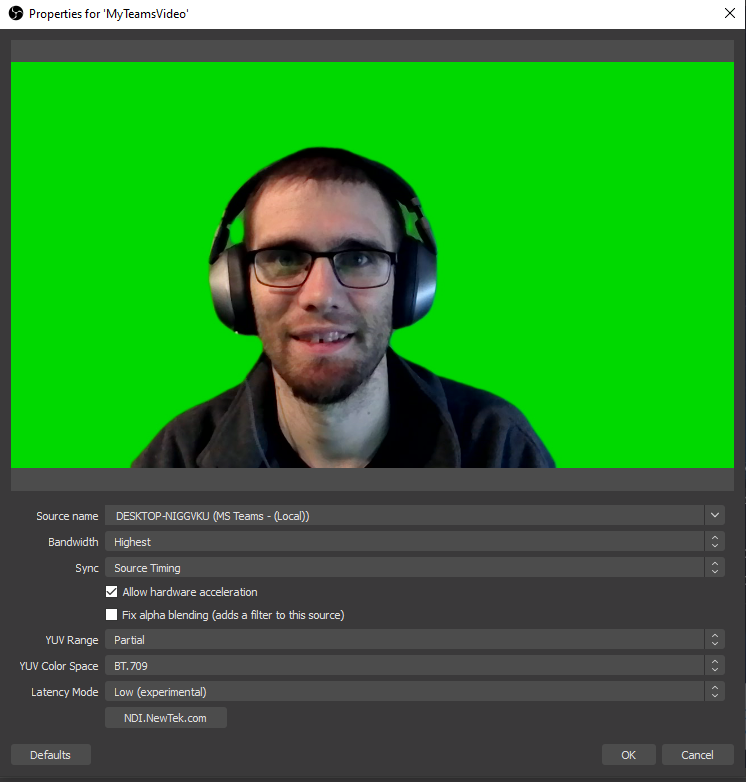
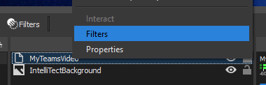
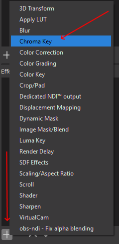
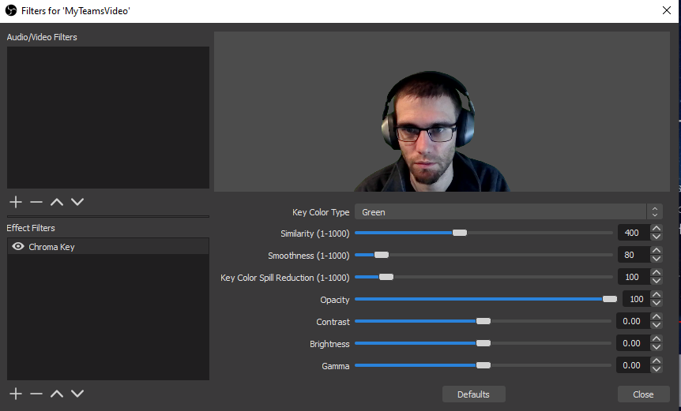
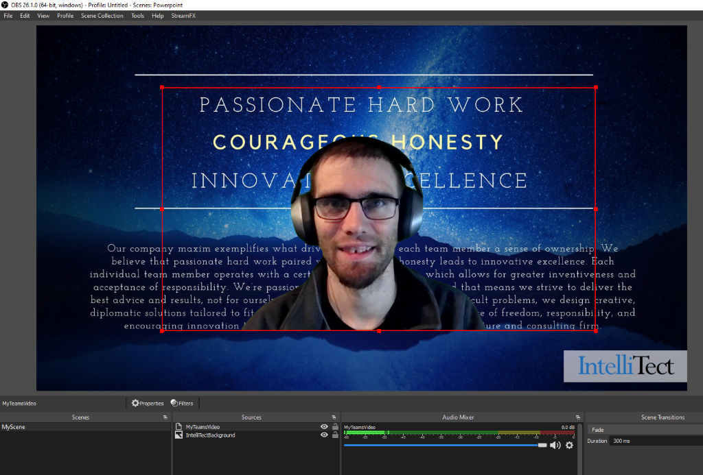

## Crafting the Perfect Stream through OBS Using Creative Backgrounds 

Estimated reading time: 6 minutes

As exciting as it is to stream or record your content with OBS (Open Broadcaster Software), it can be even better with other participants in the video stream which can be done by using a greenscreen. In my [last blog post](https://intellitect.com/streaming-online-presentation-obs-ffmpeg/), I talked about ways to share your content through OBS using a virtual camera.

In this blog post, I expand on my previous blog to show adding in a virtual greenscreen and including additional participants with NDI® (Network Device Interface) sources. I am running the Windows Microsoft Teams app version 1.3.00.32283 (64-bit). 

### Contents

- [Crafting the Perfect Stream through OBS Using Creative Backgrounds](#h-crafting-the-perfect-stream-through-obs-using-creative-backgrounds) 
    - [Enable NDI](#h-enable-ndi) 
    - [Install NDI Plugin for OBS](#h-install-ndi-plugin-for-obs) 
    - [Start a Teams Call](#h-start-a-teams-call) 
    - [Set Teams Background](#h-set-teams-background) 
    - [Add the NDI Source to OBS](#h-add-the-ndi-source-to-obs) 
    - [Add Chroma Key to the NDI Source](#h-add-chroma-key-to-the-ndi-source) 
    - [You're Ready to Stream with a Greenscreen](#h-you-re-ready-to-stream-with-a-greenscreen)
    - [Have Suggestions?](#h-have-suggestions)

### Enable NDI 

For this tutorial, I will be using Microsoft Teams; however, other software programs (such as Skype) also have NDI support. First, you need to get Microsoft Teams enabled for your user by an admin. It is important to note that only the person who will be running OBS will need this enabled. Other users on the call interact with Teams as they would in a normal call. 

After NDI has been enabled for you user, you will need to enable NDI within your Team’s settings. 

### Install NDI Plugin for OBS 

Download the latest [NDI plugin for OBS](https://github.com/Palakis/obs-ndi). Next, run the installer. After the installation is complete, you should see an additional NDI Source in the list of sources that you can add to OBS. For now, note the presence of the option. We will make use of it later. 

### Start a Teams Call 

Next, join a Teams call and enable NDI broadcasting. Click on the ellipsis (three dots; More actions button) and select Broadcast over NDI. Teams will [notify participants](https://support.microsoft.com/en-us/office/broadcasting-audio-and-video-from-teams-with-ndi%C2%AE-technology-e91a0adb-96b9-4dca-a2cd-07181276afa3) that broadcasting capabilities have been turned on.  

Importantly, you will need to do this each time you join a Teams call if you wish to access the NDI streams from Teams within OBS. 

### Set Teams Background 

[Teams recommends](https://www.microsoft.com/microsoft-365/microsoft-teams/background-blur) that you use a background with “an aspect ratio of 16:9 and a resolution of at least 1920 x 1080”. Here is a sample image that can be used for the background. 

Alternatively, you can create your own greenscreen image by opening an image editor and setting the image size to 1920 x 1080. Typically, the greenscreen color is RGB (8,255,8) or in Hex (#08FF08). [Set this as your background image](https://support.microsoft.com/office/change-your-background-for-a-teams-meeting-f77a2381-443a-499d-825e-509a140f4780). Also, you will need to turn on your camera in Teams. If there are other participants in the meeting that you would like to include in your OBS scene, ask them to set it as their background image too. In the end, your video in Teams should look something like this. 

### Add the NDI Source to OBS 

Back in OBS, you are now ready to set up your scene. For this, I will use a simple background image (just adding a new Image Source) and place my video stream on top of it. Using the NDI™ Source menu item that we identified earlier, create a new NDI source and give it a friendly name. 

Under the Source name, you should see several NDI Streams from the Teams call (you will need at least one other person in the call before the dropdown is populated). To get your own video stream, simply select the one that ends in “(MS Teams – (Local)).” Once you see the preview, start press OK. My final configuration looks like this. 

Repeat this process for any additional participants that you want to include in your OBS scene. 

### Add Chroma Key to the NDI Source 

Finally, we need to remove the virtual greenscreen. To do this, right-click on the NDI Source and select Filters. 

In the _lower_ Effects Filters section, add a new Chroma Key filter. For mine, I simply used the default name of “Chroma Key.”  

Since we are using a fixed image, the default settings should properly remove the greenscreen background. 

Repeat this process for any additional NDI sources that you added for other participants. 

The result will be that you have NDI video source within OBS that you can then arrange to your preference, for a nice, professional look. 

### You're Ready to Stream with a Greenscreen

That’s all there is to it. Now, you can gain a virtual greenscreen using Microsoft Teams to perform the background subtraction. Remember to re-enable NDI broadcasting each time you join a Teams call to see the NDI Sources within Teams. Then, you can combine this technique with my [previous blog post](https://intellitect.com/streaming-online-presentation-obs-ffmpeg/) to host several participants.   

### Have Suggestions?

What other setups would you like to use in your presentations? Let me know in the comments below.  

\*A big thank you to James Milholland for inspiring this idea and sitting around on Teams calls with me. 

