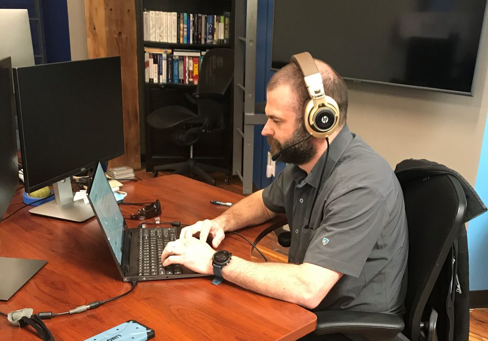

## Define the Problem and Voice Client-Clarifying Questions with Confidence

A non-trivial part of a successful software consultant’s job is understanding what the client’s problem is. A significant impediment to that problem is walking away from discussions and requirements gathering meetings _knowing_ you don’t understand the issue but feel uncomfortable addressing it.

This article will describe techniques you can use to foster a comfortable environment for yourself when working for a client.

### Distinguishing the Problem vs. the Solution

 A surprisingly common problem in the world of software consulting is truly comprehending the problem you’re trying to solve before starting the project. There are many understandable reasons why this happens. For example, a client may not be providing an environment where you feel comfortable asking questions for fear of looking incompetent; the client may have directed you to a specific solution with a tone of “it’s this way or no way;” the topic may be inherently difficult to understand, etc.

I address the dilemma of not understanding the problem entirely due to feeling uncomfortable admitting “I don’t get it.” While there’s no silver bullet to mitigate this feeling entirely, there are some techniques you can do to help maximize a requirements-gathering environment where you feel comfortable speaking up.

### The Problem with Not Understanding the Problem

The issue with confusion concerning the task at hand seems self-evident; however, there are compelling arguments to the contrary. For example: “The client instructed me to do X specifically, is paying me to do X specifically, why would I fight that?” or “I feel silly if I clarify the problem now…. Maybe if I give it a few days or weeks, I’ll assimilate some more background knowledge and feel comfortable asking then.” These are both valid reasons to get started without fully understanding the problem.

Regardless of whether or not a client directs (or demands) a specific solution or you feel uncomfortable getting to the heart of the problem, we can all agree _it sure would be great_ if we understood the situation we’re assigned to resolve. In reality, this sometimes isn’t possible, and it’s OK to recognize that. While fully understanding the “why” behind what you’re doing is ideal, but sometimes not possible, we can control the environment a little bit to help maximize this chance.

### Creating a Problem-Speak Environment

I find the initial meeting is critical in setting the tone to help maximize your comfort in asking questions, admitting you don’t understand something, etc. so that you ensure you [leave understanding as much of the _problem_ as possible.](https://www.linkedin.com/pulse/problem-talk-vs-solution-keisuke-taketani/)

Surprisingly, I found there’s not much to it.

Chris Finlayson, senior software architect, practices creating a requirements-gathering environment while on a call with a client.

During the initial introductions of a requirements-gathering meeting, be sure to mention the following:

- Tell them you want to leave the meeting understanding as much of the _problem_ you’re trying to solve as possible and not just uncover the solution.
- Remind them that nobody knows their business and their specific expertise within their company better than them. You, therefore, are likely to ask clarifying questions that sound stupid to them. It’s helpful to remind them that your expertise isn’t their expertise.
- It’s OK to talk about the problem in terms of a solution. For example, “You’re going to want to put on a jacket” is describing a solution to the complication of “it’s cold outside.”  It does intuitively work in that context to convey the problem implicitly. Sometimes though, a client will ask you to dig a metaphorical hole. It’s not always apparent why you’re digging that hole. I’ll tell the clients it’s OK to talk about solutions if that feels natural to them. I also remind them to express patience with my clarifying questions!

### Key Takeaways for Maximizing Productive Requirements-Gathering Conversations

Before getting into the requirements-gathering discussions, explicitly set the tone. How you do this is at your discretion. I typically weave it into the beginning of conversations and touch on the following key takeaways. The spirit of my message to the client is as follows:

- Focus on the problem
- I don’t know your business, so I am likely to ask questions that demonstrate my lack of expertise
- Feel free to talk in terms of a solution naturally (as a heads up, I’m going to be asking a lot of clarifying questions)

Encourage a comfortable, conversational environment (the less formal, the better). The safer people feel, the more likely you will hear productive phrases such as: “I don’t understand…,” and, “Can you explain why again?”

Additionally, when you use these takeaways, the audience will generally be more receptive to ideas.

### Want More?

Feel free to leave any questions or comments below! Check out _[Agile Demystified: 7 Metrics to Assess Your Agile Practices](/demystified-agile/)_ or _[Software Solutions Demystified: Buy or Build with Confidence](/demystified-buy-or-build/)_.

