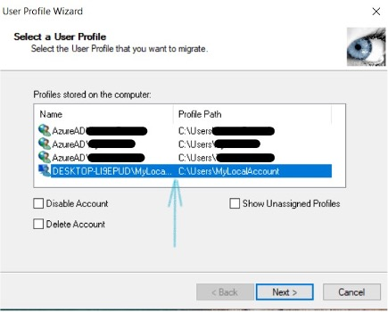
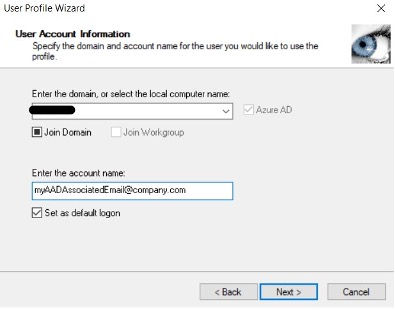

## Reduce Friction: Migrate to Azure Active Directory (AAD) and Keep Your Previous Accounts’ Data and Profiles

I recently joined a small office of Windows 10 computers to Azure Active Directory (AAD join) to improve security and workflow for the company by following Microsoft’s recommended best practices. I needed to figure out how to do this without taking the extra time to manually back up each of the computers' existing employee accounts.

Microsoft has not implemented a way to seamlessly AAD Join a Windows 10 computer to an AAD already used with a local account. The current joining process creates a new AAD account on the machine which is not helpful because the new account is empty and not associated with the user's existing account with all their data and work. An employee will wonder why you wasted a bunch of time to “AAD Join” their computer.

This guide answers the question: How can we seamlessly “turn” an existing account (local or Microsoft) into an AAD account so that its user can get right back to work?

### Cloning the Local Account to the AAD Account

Windows 10 stores user account data under a profile. We want the AAD account to be a copy of the local account profile. I use a donation-based tool called User Profile Wizard from a company called [Forensit](https://www.forensit.com/domain-migration.html) to do just that! A corporate license option for the User Profile Wizard with more features is also available.

###### Note: The following presumes that you have joined the machine to the active directory (see [this article](https://www.top-password.com/blog/add-windows-10-to-active-directory-domain/) for ways to do that).

Sign in to an AAD account and use the User Profile Wizard tool to do the following:

1. Select the local account you wish to clone. Click “Next.”

2\. Make sure the domain is correct in the “Enter the domain…” field. This field should be correctly auto-filled from the start.

3\. Enter in the email of the Active Directory Account that you want to clone. Click “Next.”

The process takes a few minutes depending on the extent of the user account’s file usage. When complete, the pre-existing account’s profile will be copied to the AAD account’s profile, and the files of the pre-existing account will be associated with the AAD account. i.e. The profile of “exampleExistingUserAccountName” will be cloned to the profile of the user’s “AzureADexampleAADUserName” account. At this point, the computer will need to restart.

### Successful Transfer

After the computer restarts and the user is signed back into the associated AAD account, the user will need to log in to some apps and reattached network drives. However, their files, bookmarks, and wallpaper will be transferred to the AAD account!

When done, if everything looks good, you can safely remove the previous account. The files are now associated with the new AAD account.

You've eliminated the headache of joining a previously used machine to AAD! Congrats!

### Want More?

If you have any other tips or tricks, feel free to comment below! Looking to maximize your adventures in Azure? Check out our blog on [fully managed password authentication for Azure SQL Database.](https://intellitect.com/passwordless-authentication-azure-sql/)
